English| [中文版](README.zh-CN.md)
# Non-negative Matrix Factorization using NumPy
- [Quick Start](#rocket-quick-start)
- [1. Introduction](#1-sparkles-introduction)
- [2. NMF Variants](#2-sparkles-nmf-variants)
- [3. Noise Types](#3-sparkles-noise-types)
- [4. Setup and Execution](#4-sparkles-setup-and-execution)
- [5. Convergence Trends](#5-sparkles-convergence-trends)
- [6. Results](#6-sparkles-results)
  - [6.1. Metrics](#61-metrics)
    - [6.1.1. What are They?](#611-what-are-they)
    - [6.1.2. Why RMSE More Important?](#612-why-rmse-more-important)
  - [6.2. Performance on ORL and YaleB Datasets](#62-performance-on-orl-and-yaleb-datasets)
  - [6.3. Reconstruction Effects](#63-reconstruction-effects)
- [7. Project Structure](#7-sparkles-project-structure)
- [8. TODO](#8-todo)
- [9. Contribution](#9-handshake-contribution)

:pushpin: **Important Notice**:
Please ensure that dataset files are placed in the `data` directory before executing `run.py`. For emphasis, we've incorporated an error notification mechanism. Moreover, we've provided comprehensive docstrings and comments within our code. Should you have any questions, feel free to explore our source code in depth.

Please refrain from intentionally inputting unexpected data types to test our algorithms. We do not have initial input type assertions, so they cannot reject inappropriate inputs from the start. Thank you for your understanding.

## :rocket: Quick Start
1. Simplicity

To swiftly experience the method in action, simply configure and run the following in `run.py`:
```python
from algorithm.pipeline import Pipeline

pipeline = Pipeline(nmf='L1NormRegularizedNMF', # Options: 'L2NormNMF', 'L1NormNMF', 'KLdivergenceNMF', 'ISdivergenceNMF', 'RobustNMF', 'HypersurfaceNMF', 'L1NormRegularizedNMF', 'CappedNormNMF', 'CauchyNMF'
                    dataset='ORL', # Options: 'ORL', 'YaleB'
                    reduce=1, # ORL: 1, YaleB: 3
                    noise_type='uniform', # Options: 'uniform', 'gaussian', 'laplacian', 'salt_and_pepper', 'block'
                    noise_level=0.02, # Uniform, Gassian, Laplacian: [.1, .3], Salt and Pepper: [.02, .10], Block: [10, 20]
                    random_state=3407, # 0, 42, 99, 512, 3407 in our experiments
                    scaler='MinMax') # Options: 'MinMax', 'Standard'

# Run the pipeline
pipeline.run() # Parameters: max_iter: int, convergence_trend: bool, matrix_size: bool
pipeline.evaluate() # Parameters: idx: int, imshow: bool
```

2. Convenience

You are invited to try out our experiments on Google Colab. First, execute all the code snippets in the `Setup` section to access our repository. Also, all you need to do is upload the `data.zip` file.

Once the experimental environment is set up, you have the choice to either run `run.py` in the terminal or adjust the default settings and then execute the script within the Jupyter notebook as you see fit.

[](https://colab.research.google.com/github/XavierSpycy/NumPyNMF/blob/main/run.ipynb)

For a more comprehensive setup and detailed execution instructions, please refer to the "Setup and Execution" section.

## 1. :sparkles: Introduction
It is a matrix factorization technique where all the elements of the decomposed matrices are required to be non-negative. This kind of decomposition is especially suitable for datasets where all the elements are non-negative, such as image data or text data.

NMF aims to decipher the following formula:

$$X \approx D R$$

<p align="center">
  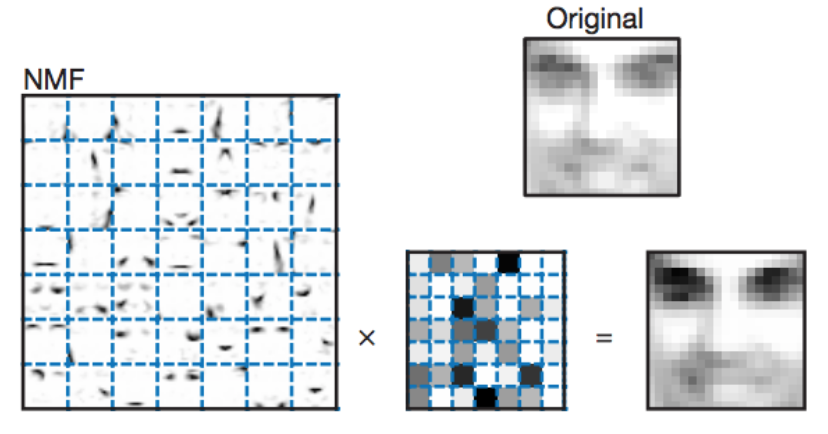
  <br>
  Figure 1. Illustration of NMF
</p>

Where, if 
$X$ is of size $m \times n$, typically $D$ would be of size $m \times k$ and $R$ would be of size $k \times n$, where $k$ is a predefined number of factors and is usually less than both $m$ and $n$.

NMF has found utility in many applications, including feature extraction, image processing, and text mining.

Our experiments seek to compare the robustness of various NMF variants.

<p align="center">
  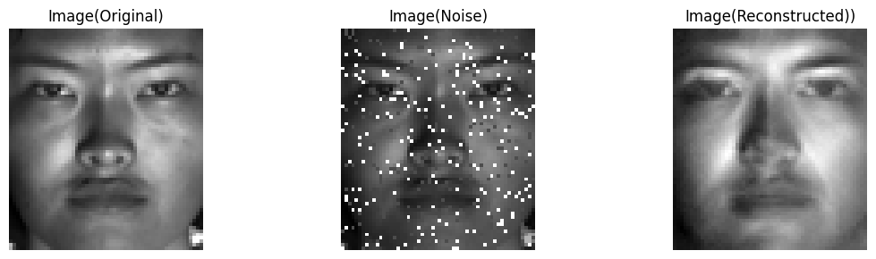
  <br>
  Figure 2. Illustration of Our Experiments
</p>

- **2** Datasets: ORL, Cropped YaleB              
- **9** NMFs: $L_2$ Norm Based, $L_1$ Norm Based, KL Divergence, IS Divergence, $L_{2, 1}$ Norm Based, Hypersurface Cost, $L_1$ Norm Regularized, Capped Norm Based, Cauchy              
- **5** Noise Types: Uniform, Gaussian, Laplacian, Block Occlusion, Salt and Pepper

## 2. :sparkles: NMF Variants
**Note**: GitHub itself does not support rendering LaTeX math formulas in Markdown previews, so some formulas may not display correctly. You might want to use other tools to view these formulas.

- $L_2$ Norm Based NMF
  - Cost Function:
  $\lVert X - DR \rVert^2 = \sum_{\substack{ijk}}(x_{ij} - d_{ik}r_{kj})^2$
  - Update Rule:          
  $\mathbf{D} \leftarrow \mathbf{D} \times \frac{\mathbf{X} \mathbf{R^\top}}{\mathbf{D} \mathbf{R} \mathbf{R^\top}}\\   
  \mathbf{R} \leftarrow \mathbf{R} \times \frac{\mathbf{D^\top} \mathbf{X}}{\mathbf{D^\top} \mathbf{D} \mathbf{R}}$

- $L_1$ Norm Based NMF
  - Cost Function:      
  $\left | \mathbf{X - DR} \right | = \sum_{\substack{ijk}}\left | x_{ij} - d_{ik}r_{kj} \right |$
  - Update Rule:      
  $\nabla_{\mathbf{D}} = - (\mathbf{X} - \mathbf{DR}) \mathbf{R}^\top \\
    \nabla_{\mathbf{R}} = - \mathbf{D}^\top (\mathbf{X} - \mathbf{DR}) \\
    \mathbf{D} \leftarrow \mathrm{sign}(\mathbf{D} - \alpha \nabla_{\mathbf{D}}) \times \mathrm{max}(0, |\mathbf{D} - \alpha \nabla_{\mathbf{D}}| - \alpha) \\
    \mathbf{R} \leftarrow \mathrm{sign}(\mathbf{R} - \alpha \nabla_{\mathbf{R}}) \times \mathrm{max}(0, |\mathbf{R} - \alpha \nabla_{\mathbf{R}}| - \alpha)$

- KL Divergence NMF
  - Cost Function:      
  $d_{KL}(\mathbf{X} \lVert \mathbf{DR}) = \sum_{\substack{ijk}}(x_{ij}\mathrm{log}\frac{x_{ij}}{d_{ik}r_{kj}} - x_{ij} + d_{ik}r_{kj})$
  - Update Rule:      
  $\mathbf{D} \leftarrow \mathbf{D} \times \frac{(\frac{\mathbf{X}}{\mathbf{DR}})\mathbf{R}^\top}{\mathbf{1}_{m,n} \cdot \mathbf{R}^\top}\\
  \mathbf{R} \leftarrow \mathbf{R} \times \frac{\mathbf{D}^\top \left(\frac{\mathbf{X}}{\mathbf{DR}} \right)}{\mathbf{D}^\top \cdot \mathbf{1}_{m,n}}$

- IS Divergence NMF
  - Cost Function:      
  $d_{IS}(\mathbf{X} \lVert \mathbf{DR}) = \frac{\mathbf{X}}{\mathbf{DR}} - \mathrm{log}\frac{\mathbf{X}}{\mathbf{DR}} - 1$
  - Update Rule:      
  $\mathbf{D} \leftarrow \mathbf{D} \times \frac{((\mathbf{DR}^{-2}) \mathbf{X})\mathbf{R}^\top}{(\mathbf{DR})^{-1} \mathbf{R}^\top}\\
  \mathbf{R} \leftarrow \mathbf{R} \times \frac{\mathbf{D}^\top ((\mathbf{DR})^{-2}\mathbf{X})}{\mathbf{D}^\top (\mathbf{DR})^{-1}}$

- $L_{2, 1}$ Norm Based NMF
  - Cost Function:      
  $\lVert \mathbf{X - DR} \rVert_{2, 1} = \sum_{\substack{i=1}}^n \sqrt{\sum_{\substack{j=1}^p}(\mathbf{X} - \mathbf{DR})_{ji}^2}  = \sum_{\substack{i=1}}^n \lVert x_i - \mathbf{D}r_i \rVert$
  - Update Rule:      
  $D_{ji} \leftarrow D_{jk} \times \frac{(\mathbf{X \Lambda R^\top})_{jk}}{(\mathbf{DR\Lambda R^\top})_jk} \\
  R_{ki} \leftarrow R_{ki} \times \frac{(\mathbf{D^\top X\Lambda})_{ki}}{(\mathbf{D^\top DR\Lambda})_{jk}}\\
  $
  where $\Lambda$ is a diagonal matrix with the diagonal elements given by,     
  $D_{ii} = \frac{1}{\sqrt{\sum_{\substack{j=1}}^p(\mathbf{X - DR})_{ji}^2}} = \frac{1}{\lVert x_i - \mathbf{D}r_i \rVert}$

- Hypersurface Cost NMF
  - Cost Function:
  $\phi(\mathbf{D}, \mathbf{R}) = \frac{1}{2}(\sqrt{1 + \lVert \mathbf{X} - \mathbf{DR} \rVert^2} - 1)$
  - Update Rule:      
  $\mathbf{D} \leftarrow \mathbf{D} - \alpha\frac{\mathbf{DRR}^{\top} - \mathbf{XR}^{\top}}{\sqrt{1 + \lVert \mathbf{X} - \mathbf{DR} \rVert}}\\
  \mathbf{R} \leftarrow \mathbf{R} - \beta \frac{\mathbf{D}^{\top}\mathbf{DR} - \mathbf{D}^{\top}\mathbf{X}}{\sqrt{1 + \lVert \mathbf{X} - \mathbf{DR} \rVert}}$

- $L_1$ Norm Regularized NMF
  - Cost Function:
  $\lVert \mathbf{X} - \mathbf{DR} - \mathbf{S}\rVert_F^2 + \lambda \lVert S \rVert_1$
  - Update Rule:      
  $\mathbf{S} \leftarrow \mathbf{X} - \mathbf{DR}\\
  \mathbf{S}_{ij} \leftarrow 
    \begin{cases}
        \mathbf{S}_{ij} - \frac{\lambda}{2} \text{  , if} \mathbf{S}_{ij} > \frac{\lambda}{2} \\
        \mathbf{S}_{ij} + \frac{\lambda}{2} \text{  , if} \mathbf{S}_{ij} < \frac{\lambda}{2}\\
        0 \text{    , otherwise}
    \end{cases}\\
    \mathbf{D} \leftarrow \frac{\left | (\mathbf{S} - \mathbf{X})\mathbf{R}^{\top}\right | - ((\mathbf{S} - \mathbf{X})\mathbf{R}^{\top}}{2\mathbf{DRR}^{\top}}\\
    \mathbf{R} \leftarrow \frac{\left |\mathbf{D}^{\top}(\mathbf{S} - \mathbf{X})\right | - (\mathbf{D}^{\top}(\mathbf{S} - \mathbf{X})}{2\mathbf{D^{\top}}\mathbf{DR}}\\
    \mathbf{D} \leftarrow \frac{\mathbf{D}}{\sqrt{\sum^n_{k=1}\mathbf{D}_{kj}^2}}\\
    \mathbf{R} \leftarrow \mathbf{R}\sqrt{\sum^n_{k=1}\mathbf{D}_{kj}^2}$

- Capped Norm Based NMF
  - Update Rule:     
  $\mathbf{D} \leftarrow \mathbf{D}\frac{\mathbf{XIR}^\top}{\mathbf{DRIR}^{\top}}\\
  \mathbf{R} \leftarrow \mathbf{R}\sqrt{\frac{\mathbf{IXD}}{\mathbf{IR}^{\top}\mathbf{RXD}}}\\
  \mathbf{I}_{jj} = 
    \begin{cases} \frac{1}{2\lVert x_j - \mathbf{D}r_j\rVert_2}\text{   , if} \lVert x_j - \mathbf{D}r_j\rVert \leq \theta \\
    0 \text{    , otherwise}
    \end{cases}$,      
    where $\mathbf{I}$ is initialized as an identify mamtrix and then will be updated to a diagonal matrix.

- Cauchy NMF
  - Update Rule:         
  $\theta \leftarrow \theta \cdot \frac{b_\theta}{a_\theta + \sqrt{a_\theta^2 + 2b_\theta \cdot a_\theta}}$     
  For $\mathbf{D}$,     
  $a_\theta =  \frac{3}{4} \frac{\sigma}{\sigma^2 + \mathbf{X}} \mathbf{R}^\top\\
  b_\theta = \sigma^{-1}\mathbf{R}^\top$;     
  For $\mathbf{R}$,     
  $a_\theta = \frac{3}{4}\mathbf{D}^{\top}\frac{\sigma}{\sigma^2 + \mathbf{X}}\\
   b_\theta = \mathbf{D}^{\top}\sigma^{-1}$

## 3. :sparkles: Noise Types
- Uniform:
<p align="center">
  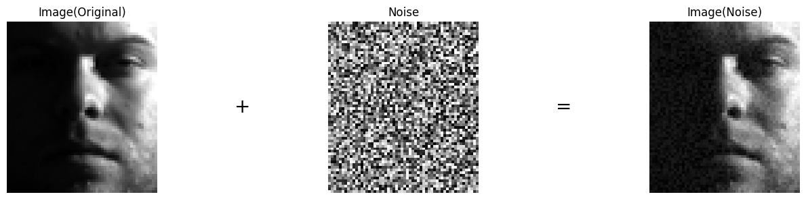
  <br>
  Figure 3. Uniform Noise
</p>

- Gaussian
<p align="center">
  
  <br>
  Figure 4. Gaussian Noise
</p>

- Laplacian
<p align="center">
  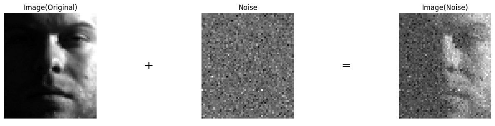
  <br>
  Figure 5. Laplacian Noise
</p>

- Block Occlusion
<p align="center">
  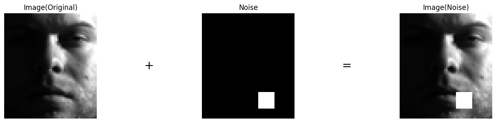
  <br>
  Figure 6. Block Noise
</p>

- Salt and Pepper
<p align="center">
  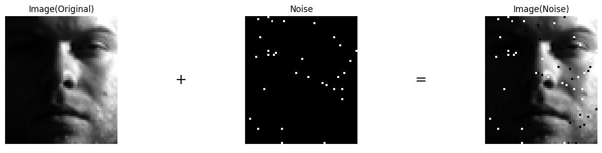
  <br>
  Figure 7. Salt and Pepper Noise
</p>

## 4. :sparkles: Setup and Execution
### Step 1. Environmental Setup
**If you're not concerned about package version conflicts, you may skip this step.**

To avoid potential conflicts between package versions, we ensure smooth execution only under our specified package versions. We can't guarantee flawless operation across all versions of the related packages. However, if you have concerns or wish to ensure the highest compatibility, you can follow the steps below to create a new environment specifically for this experiment.

1. **Create a New Conda Environment:**

   First, you'll want to create a new Conda environment named `NumPyNMF`. To do this, open your terminal or command prompt and enter the following command:

   ```bash
   $ conda create --name NumPyNMF python=3.8
   ```
2. **Activate the New Environment:**

    Before installing any packages or running any scripts, you must activate the `NumPyNMF` environment. To do this, enter the following command:
    ```bash
    $ conda activate NumPyNMF
    ```

3. **Install Required Packages:**

    Navigate to the directory where the `requirements.txt` file is located and install the necessary packages using `pip`:
    ```bash
    $ pip install -r requirements.txt
    ```
4. **Running the Experiment:**

    After setting up the environment and installing the required packages, always ensure that the `NumPyNMF` environment is activated before executing any scripts.

**Important**: As mentioned, we've tailored this environment to avoid potential version conflicts, ensuring optimal compatibility with our codebase. Please use this environment to ensure accurate and conflict-free execution.

### Step 2. Experiment Execution

To run the current experiment, follow these steps:

1. **Configure the Algorithm and Dataset:** In `run.py`, we provide a `Pipeline` class. You can configure your experiment by adjusting its parameters. Here's an explanation of the `Pipeline` parameters:

    - `nmf`: Choose the desired Non-negative Matrix Factorization (NMF) algorithm. Options are: `L2NormNMF`, `L1NormNMF`, `KLdivergenceNMF`, `ISdivergenceNMF`, `RobustNMF`, `HypersurfaceNMF`, `L1NormRegularizedNMF`, `CappedNormNMF`, `CauchyNMF`.
    
    - `dataset`: Select the dataset. Options are: `ORL`, `YaleB`.
    
    - `reduce`: In our experiments, use `1` for `ORL` and `3` for `YaleB`. If the value is too small, the execution time will be excessive; if too large, it will result in information loss.
    
    - `noise_type`: The type of noise. Choices are: `uniform`, `gaussian`, `laplacian`, `salt_and_pepper`, `block`.
    
    - `noise_level`: The level of noise. The specific values vary depending on your choice of noise type.
    
    - `random_state`: The random seed value used in the experiment. In our experiments, we've used: `0`, `42`, `99`, `512`, `3407`.
    
    - `scaler`: The method for data normalization. Choices are: `MinMax`, `Standard`.

2. **Run the Pipeline:**
    ```python
    pipeline.run() 
    ```
    Optional parameters include: `max_iter` (maximum iterations), `convergence_trend` (display convergence trend), `matrix_size` (show matrix size or note), and `verbose` (show training procedure or not).

3. **Evaluate the Results:**
    ```python
    pipeline.evaluate()
    ```
    Optional parameters are: `idx` (index), and `imshow` (display image or not).

### Step 3: Running the Script in Terminal

After you've configured your experiment parameters in the `run.py` script, you can execute the experiment directly from the terminal. Follow these steps:

1. **Navigate to the Directory:**
   
   First, make sure you're in the directory where the `run.py` file is located. Use the `cd` command followed by the directory path to navigate. For example:

   ```bash
   $ cd path/to/your/directory/NumPyNMF
   ```

2. **Execute the Script:**

    Run the script using Python. Depending on your setup, you might use python, python3, or another variation. Here's the general command:
    ```bash
    $ python run.py
    ```

    If you're using Python 3 specifically and have both Python 2 and Python 3 installed, you might use:
    ```bash
    $ python3 run.py
    ```

Hope this helps you carry out the experiment smoothly!

## 5. :sparkles: Convergence Trends
</p>

- $L_1$ Norm Based NMF:
<p align="center">
  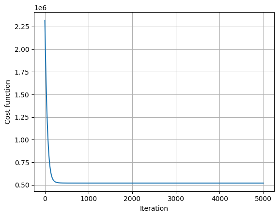
  <br>
  Figure 8. Convergence Trend of L<sub>1</sub> Norm Based NMF
</p>


- $L_{2, 1}$ Norm Based NMF:
<p align="center">
  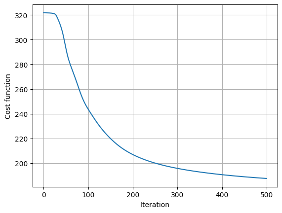
  <br>
  Figure 9. Convergence Trend of L<sub>2, 1</sub> Norm Based NMF
</p>

## 6. :sparkles: Results
### 6.1. Metrics
#### 6.1.1. What are They?
- Root Means Square Errors (RMSE)     
$\mathrm{RMSE} = \sqrt{\frac{1}{N} \lVert \mathbf{X - DR} \rVert^2_F}$
- Average Accuracy      
$\mathrm{Acc(Y, Y_{pred})} = \frac{1}{n} \sum_{\substack{i}}^n \{\mathrm{{Y_{(pred)(i)}}} = \mathrm{Y(i)}\}$
- Normalized Mutual Information (NMI)     
$\mathrm{NMI(Y, Y_{pred})} = \frac{2 \times I(\mathrm{Y, Y_{pred}})}{H(\mathrm{Y}) + H(\mathrm{Y_{pred})}}$,      
where $I(\cdot, \cdot$) is the mutual information, $H(\cdot)$ is the entropy.

#### 6.1.2. Why RMSE More Important?

<p align="center">
  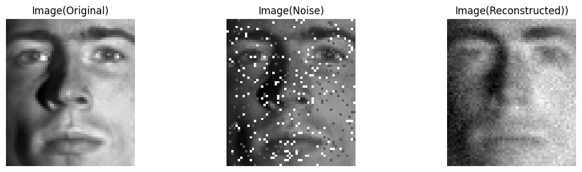
  <br>
  Figure 10. Greater RMSE, Average Accuracy and NMI
</p>

<p align="center">
  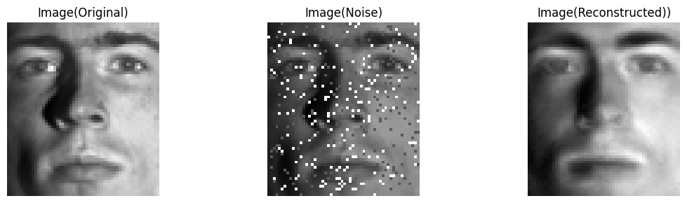
  <br>
  Figure 11. Less RMSE, Average Accuracy and NMI
</p>

As illustrated in Figure 10, the reconstructed image exhibits a higher level of granularity.

### 6.2. Performance on ORL and YaleB Datasets
In our preliminary experiments, we observed that certain NMFs might not perform optimally on our specific datasets. This could be attributed to:

- The inherent characteristics of the datasets.
- Potential implementation errors (we leave this to future
work).

We warmly welcome you to delve into our source code and contribute to its enhancement.

<style>
    table, th, td {
        border: 1px solid black;
        text-align: center;
    }
</style>
<table border="1">
    <thead>
        <tr>
            <th rowspan="2">Dataset</th>
            <th rowspan="2">Noise Type</th>
            <th rowspan="2">Noise Level</th>
            <th rowspan="2">Metrics</th>
            <th colspan="4">NMF Algorithm</th>
        </tr>
        <tr>
            <th><i>L<sub>2</sub></i> Norm</th>
            <th><i>L<sub>2,1</sub></i> Norm</th>
            <th>KL Divergence</th>
            <th><i>L<sub>1</sub></i> Norm Regularized</th>
        </tr>
    </thead>
    <tbody>
        <tr>
            <td rowspan="36">ORL</td>
            <td rowspan="12">Uniform</td>
            <td rowspan="6">0.1</td>
            <td rowspan="2">RMSE</td>
            <td>.1082</td>
            <td>.1119</td>
            <td><b>.1079</b></td>
            <td>.1099</td>
        </tr>
        <tr>
            <td>(<i>.0004</i>)</td>
            <td>(.0006)</td>
            <td>(.0006)</td>
            <td>(.0006)</td>
        </tr>
        <tr>
          <td rowspan="2">Average Accuracy</td>
            <td>.5694</td>
            <td>.5889</td>
            <td>.5805</td>
            <td><b>.6367</b></td>
        </tr>
        <tr>
            <td>(.0270)</td>
            <td>(.0353)</td>
            <td>(.0241)</td>
            <td>(<i>.0234</i>)</td>
        </tr>
        <tr>
          <td rowspan="2">NMI</td>
            <td>.7364</td>
            <td>.7497</td>
            <td>.7412</td>
            <td><b>.7906</b></td>
        </tr>
        <tr>
            <td>(.0252)</td>
            <td>(.0294)</td>
            <td>(<i>.0167</i>)</td>
            <td>(.0183)</td>
        </tr>
        <td rowspan="6">0.3</td>
            <td rowspan="2">RMSE</td>
            <td>.2395</td>
            <td>.2410</td>
            <td><b>.2388</b></td>
            <td>.2426</td>
        </tr>
        <tr>
            <td>(<i>.0004</i>)</td>
            <td>(.0006)</td>
            <td>(.0006)</td>
            <td>(.0006)</td>
        </tr>
        <tr>
          <td rowspan="2">Average Accuracy</td>
            <td>.5694</td>
            <td>.5889</td>
            <td>.5805</td>
            <td><b>.6367</b></td>
        </tr>
        <tr>
            <td>(.0017)</td>
            <td>(.0017)</td>
            <td>(<i>.0017</i>)</td>
            <td>(.0019)</td>
        </tr>
        <tr>
          <td rowspan="2">NMI</td>
            <td>.7509</td>
            <td>.7367</td>
            <td>.7524</td>
            <td><b>.7941</b></td>
        </tr>
        <tr>
            <td>(.0120)</td>
            <td>(.0165)</td>
            <td>(.0200)</td>
            <td>(<i>.0113</i>)</td>
        </tr>
        <tr>
            <td rowspan="12">Block</td>
            <td rowspan="6">10</td>
            <td rowspan="2">RMSE</td>
            <td>.1048</td>
            <td>.1049</td>
            <td>.0957</td>
            <td><b>.0800</b></td>
        </tr>
        <tr>
            <td>(.0004)</td>
            <td>(.0005)</td>
            <td>(.0004)</td>
            <td>(<i>.0003</i>)</td>
        </tr>
        <tr>
          <td rowspan="2">Average Accuracy</td>
            <td>.4878</td>
            <td>.5089</td>
            <td>.5450</td>
            <td><b>.5978</b></td>
        </tr>
        <tr>
            <td>(.0236)</td>
            <td>(.0224)</td>
            <td>(.0447)</td>
            <td>(<i>.0077</i>)</td>
        </tr>
        <tr>
          <td rowspan="2">NMI</td>
            <td>.6647</td>
            <td>.6938</td>
            <td>.7074</td>
            <td><b>.7738</b></td>
        </tr>
        <tr>
            <td>(.0217)</td>
            <td>(.0178)</td>
            <td>(.0259)</td>
            <td>(<i>.0061</i>)</td>
        </tr>
        <td rowspan="6">20</td>
            <td rowspan="2">RMSE</td>
            <td>.2062</td>
            <td>.2039</td>
            <td>.1931</td>
            <td><b>.1886</b></td>
        </tr>
        <tr>
            <td>(<i>.0013</i>)</td>
            <td>(.0016)</td>
            <td>(.0015)</td>
            <td>(.0046)</td>
        </tr>
        <tr>
          <td rowspan="2">Average Accuracy</td>
            <td>.2466</td>
            <td>.2833</td>
            <td><b>.3133</b></td>
            <td>.2928</td>
        </tr>
        <tr>
            <td>(<i>.0150</i>)</td>
            <td>(.0017)</td>
            <td>(.0017)</td>
            <td>(.0019)</td>
        </tr>
        <tr>
          <td rowspan="2">NMI</td>
            <td>.4317</td>
            <td>.4768</td>
            <td><b>.5037</b></td>
            <td>.4867</td>
        </tr>
        <tr>
            <td>(.0181)</td>
            <td>(<i>.0114</i>)</td>
            <td>(.0231)</td>
            <td>(.0276)</td>
        </tr>
        <tr>
            <td rowspan="12">Salt and Pepper</td>
            <td rowspan="6">0.02</td>
            <td rowspan="2">RMSE</td>
            <td>.0830</td>
            <td>.0863</td>
            <td>.0824</td>
            <td><b>.0794</b></td>
        </tr>
        <tr>
            <td>(.0003)</td>
            <td>(.0005)</td>
            <td>(.0003)</td>
            <td>(<i>.0003</i>)</td>
        </tr>
        <tr>
          <td rowspan="2">Average Accuracy</td>
            <td>.5829</td>
            <td>.5655</td>
            <td>.5778</td>
            <td><b>.6117</b></td>
        </tr>
        <tr>
            <td>(.0420)</td>
            <td>(.0481)</td>
            <td>(<i>.0160</i>)</td>
            <td>(.0196)</td>
        </tr>
        <tr>
          <td rowspan="2">NMI</td>
            <td>.7496</td>
            <td>.7444</td>
            <td>.7446</td>
            <td><b>.7846</b></td>
        </tr>
        <tr>
            <td>(.0250)</td>
            <td>(.0392)</td>
            <td>(.0160)</td>
            <td>(<i>.0115</i>)</td>
        </tr>
        <td rowspan="6">0.1</td>
            <td rowspan="2">RMSE</td>
            <td>.1111</td>
            <td>.1130</td>
            <td>.1057</td>
            <td><b>.0819</b></td>
        </tr>
        <tr>
            <td>(.0006)</td>
            <td>(.0008)</td>
            <td>(<i>.0002</i>)</td>
            <td>(.0008)</td>
        </tr>
        <tr>
          <td rowspan="2">Average Accuracy</td>
            <td>.5450</td>
            <td>.5322</td>
            <td>.5678</td>
            <td><b>.6445</b></td>
        </tr>
        <tr>
            <td>(<i>.0150</i>)</td>
            <td>(.0017)</td>
            <td>(.0017)</td>
            <td>(.0019)</td>
        </tr>
        <tr>
          <td rowspan="2">NMI</td>
            <td>.7379</td>
            <td>.7316</td>
            <td>.7360</td>
            <td><b>.7936</b></td>
        </tr>
        <tr>
            <td>(.0286)</td>
            <td>(.0272)</td>
            <td>(<i>.0176</i>)</td>
            <td>(.0238)</td>
        </tr>
        <tr>
            <td rowspan="42">Cropped YaleB</td>
            <td rowspan="12">Gaussian</td>
            <td rowspan="6">0.1</td>
            <td rowspan="2">RMSE</td>
            <td>.0786</td>
            <td>.0784</td>
            <td rowspan="2"> > 3000</td>
            <td><b>.0775</b></td>
        </tr>
        <tr>
            <td>(.0010)</td>
            <td>(.0006)</td>
            <td>(<i>.0002</i>)</td>
        </tr>
        <tr>
          <td rowspan="2">Average Accuracy</td>
            <td><b>.1808</b></td>
            <td>.1769</td>
            <td>.0592</td>
            <td>.1466</td>
        </tr>
        <tr>
            <td>(<i>.0073</i>)</td>
            <td>(.0115)</td>
            <td>(.0020)</td>
            <td>(.0078)</td>
        </tr>
        <tr>
          <td rowspan="2">NMI</td>
            <td><b>.2651</b></td>
            <td>.2459</td>
            <td>.0601</td>
            <td>.2137</td>
        </tr>
        <tr>
            <td>(.0133)</td>
            <td>(.0163)</td>
            <td>(<i>.0041</i>)</td>
            <td>(.0143)</td>
        </tr>
        <td rowspan="6">0.3</td>
            <td rowspan="2">RMSE</td>
            <td rowspan="2">> 2</td>
            <td rowspan="2">> 12</td>
            <td rowspan="2">> 3000</td>
            <td><b>.0885</b></td>
        </tr>
        <tr>
            <td><i>(.0017)</i></td>
        </tr>
        <tr>
          <td rowspan="2">Average Accuracy</td>
            <td>.0779</td>
            <td>.0609</td>
            <td>.0584</td>
            <td><b>.1352</b></td>
        </tr>
        <tr>
            <td>(.0369)</td>
            <td>(.0036)</td>
            <td>(<i>.0033</i>)</td>
            <td>(.0065)</td>
        </tr>
        <tr>
          <td rowspan="2">NMI</td>
            <td>.0905</td>
            <td>.0657</td>
            <td>.0636</td>
            <td><b>.1840</b></td>
        </tr>
        <tr>
            <td>(.0681)</td>
            <td>(.0067)</td>
            <td>(<i>.0046</i>)</td>
            <td>(.0122)</td>
        </tr>
        <tr>
            <td rowspan="6">Laplacian</td>
            <td rowspan="6">0.1</td>
            <td rowspan="2">RMSE</td>
            <td>.0766</td>
            <td>.0759</td>
            <td rowspan="2">> 6000</td>
            <td><b>.0735</b></td>
        </tr>
        <tr>
            <td>(.0008)</td>
            <td>(.0001)</td>
            <td>(<i>.0001</i>)</td>
        </tr>
        <tr>
          <td rowspan="2">Average Accuracy</td>
            <td>.1699</td>
            <td><b>.1785</b></td>
            <td>.0585</td>
            <td>.1463</td>
        </tr>
        <tr>
            <td>(.0189)</td>
            <td>(.0191)</td>
            <td>(.0034)</td>
            <td>(<i>.0010</i>)</td>
        </tr>
        <tr>
          <td rowspan="2">NMI</td>
            <td>.2509</td>
            <td><b>.2553</b></td>
            <td>.0583</td>
            <td>.2126</td>
        </tr>
        <tr>
            <td>(.0359)</td>
            <td>(.0250)</td>
            <td>(<i>.0031</i>)</td>
            <td>(.0057)</td>
        </tr>
        <tr>
            <td rowspan="12">Block</td>
            <td rowspan="6">10</td>
            <td rowspan="2">RMSE</td>
            <td>.1720</td>
            <td>.1702</td>
            <td>.01567</td>
            <td><b>.1097</b></td>
        </tr>
        <tr>
            <td>(.0008)</td>
            <td>(.0008)</td>
            <td>(<i>.0006</i>)</td>
            <td>(.0108)</td>
        </tr>
        <tr>
          <td rowspan="2">Average Accuracy</td>
            <td>.0924</td>
            <td>.1004</td>
            <td>.1108</td>
            <td><b>.1202</b></td>
        </tr>
        <tr>
            <td>(.0054)</td>
            <td>(.0039)</td>
            <td>(.0084)</td>
            <td>(<i>.0024</i>)</td>
        </tr>
        <tr>
          <td rowspan="2">NMI</td>
            <td>.1034</td>
            <td>.1156</td>
            <td>.1352</td>
            <td><b>.1551</b></td>
        </tr>
        <tr>
            <td>(0099)</td>
            <td>(.0110)</td>
            <td>(<i>..0090</i>)</td>
            <td>(.0134)</td>
        </tr>
        <td rowspan="6">20</td>
            <td rowspan="2">RMSE</td>
            <td>.3626</td>
            <td>.3603</td>
            <td>.3576</td>
            <td><b>.3519</b></td>
        </tr>
        <tr>
            <td>(<i>.0009</i>)</td>
            <td>(.0011)</td>
            <td>(.0011)</td>
            <td>(.0082)</td>
        </tr>
        <tr>
          <td rowspan="2">Average Accuracy</td>
            <td>.0796</td>
            <td>.0796</td>
            <td><b>.0833</b></td>
            <td>.0806</td>
        </tr>
        <tr>
            <td>(<i>.0020</i>)</td>
            <td>(.0043)</td>
            <td>(.0032)</td>
            <td>(.0034)</td>
        </tr>
        <tr>
          <td rowspan="2">NMI</td>
            <td>.1043</td>
            <td>.1156</td>
            <td><b>.1352</b></td>
            <td>.1551</td>
        </tr>
        <tr>
            <td>(.0006)</td>
            <td>(<i>.0003</i>)</td>
            <td>(.0005)</td>
            <td>(.0015)</td>
        </tr>
        <tr>
            <td rowspan="12">Salt and Pepper</td>
            <td rowspan="6">0.02</td>
            <td rowspan="2">RMSE</td>
            <td>.0743</td>
            <td>.0749</td>
            <td>.0792</td>
            <td><b>.0723</b></td>
        </tr>
        <tr>
            <td>(.0006)</td>
            <td>(<i>.0003</i>)</td>
            <td>(.0005)</td>
            <td>(.0015)</td>
        </tr>
        <tr>
          <td rowspan="2">Average Accuracy</td>
            <td>.1927</td>
            <td><b>.1994</b></td>
            <td>.1852</td>
            <td>.1416</td>
        </tr>
        <tr>
            <td>(<i>.0051</i>)</td>
            <td>(.0218)</td>
            <td>(.0167)</td>
            <td>(.0113)</td>
        </tr>
        <tr>
          <td rowspan="2">NMI</td>
            <td>.2688</td>
            <td><b>.2701</b></td>
            <td>.2665</td>
            <td>.2037</td>
        </tr>
        <tr>
            <td>(<i>.0098</i>)</td>
            <td>(.0175)</td>
            <td>(.0272)</td>
            <td>(.0120)</td>
        </tr>
        <td rowspan="6">0.1</td>
            <td rowspan="2">RMSE</td>
            <td>.1271</td>
            <td>.1227</td>
            <td>.1106</td>
            <td><b>.0728</b></td>
        </tr>
        <tr>
            <td>(.0082)</td>
            <td>(.0018)</td>
            <td>(<i>.0009</i>)</td>
            <td>(.0015)</td>
        </tr>
        <tr>
          <td rowspan="2">Average Accuracy</td>
            <td>.1418</td>
            <td>.1312</td>
            <td><b>.1592</b></td>
            <td>.1411</td>
        </tr>
        <tr>
            <td>(.0082)</td>
            <td>(.0018)</td>
            <td>(<i>.0009</i>)</td>
            <td>(.0015)</td>
        </tr>
        <tr>
          <td rowspan="2">NMI</td>
            <td>.1851</td>
            <td>.1898</td>
            <td><b>.2248</b></td>
            <td>.2078</td>
        </tr>
        <tr>
            <td>(.0268)</td>
            <td>(.0197)</td>
            <td>(<i>.0133</i>)</td>
            <td>(.0220)</td>
        </tr>
    </tbody>
</table>

### 6.3. Reconstruction Effects
- Gaussian Noise Reconstruction
<p align="center">
  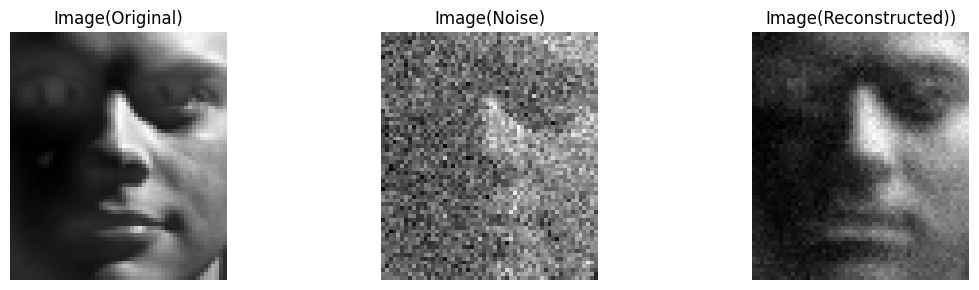
  <br>
  Figure 12. Gaussian Noise Reconstruction (Noise Level: 0.16)
</p>

- Laplacian Noise Reconstruction
<p align="center">
  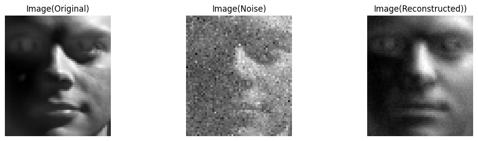
  <br>
  Figure 13. Laplacian Noise Reconstruction (Noise Level: 0.1)
</p>

- Uniform Noise Reconstruction
<p align="center">
  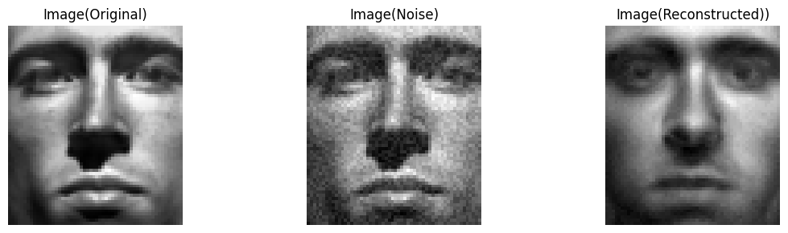
  <br>
  Figure 14. Uniform Noise Reconstruction (Noise Level: 0.1)
</p>

- Block Occlusion Noise Reconstruction
<p align="center">
  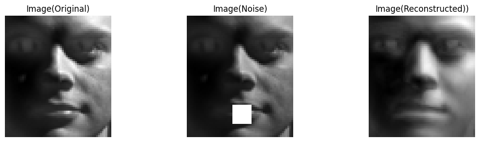
  <br>
  Figure 15. Block Occlusion Noise Reconstruction (Block Size: 10)
</p>

<p align="center">
  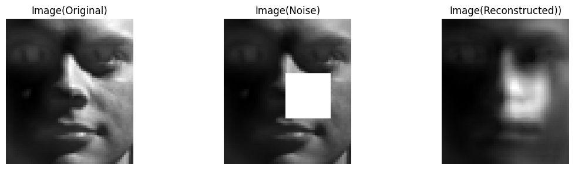
  <br>
  Figure 16. Block Occlusion Noise Reconstruction (Block Size: 20)
</p>

- Salt and Pepper Noise Reconstruction
<p align="center">
  
  <br>
  Figure 17. Salt and Pepper Noise Reconstruction (Noise Level: 0.1)
</p>

## 7. :sparkles: Project Structure
```
├── NumPyNMF/
│   ├── algorithm/
│   │   ├── __init__.py
│   │   ├── datasets.py
│   │   ├── decomposition.py
│   │   ├── evaluations.py
│   │   ├── intialization.py
│   │   ├── label.py
│   │   ├── NMF.py
│   │   ├── pipeline.py
│   │   ├── preprocess.py
│   │   ├── sample.py
│   │   ├── trainer.py
│   │   ├── user_evaluate.py
│   │   └── visualize.py
│   └── data/
│       ├── CroppedYaleB/
│       └── ORL/
├── figures/*.png
├── .gitignore
├── LICENSE
├── README.md
├── README.zh-CN.md
├── requirements.txt
├── run.ipynb
└── run.py
```

## 8. TODO
- NumPy Memory Preallocation
- Reasons for Algorithmic Non-Functionality
- GUI Interface

## 9. :handshake: Contribution
We welcome contributions of any kind, whether it's suggesting new features, reporting bugs, or helping with code optimizations. Here are the steps to get started:

### 1. Fork the Project:
- Fork this repository by clicking the "Fork" button on the top right corner of this page.

### 2. Clone Your Fork:
```bash
git clone https://github.com/YOUR_USERNAME/PROJECT_NAME.git
```

Then navigate to the project directory:
```bash
cd PROJECT_NAME
```
### 3. Create a New Branch:
- Name your branch based on the change you're implementing, e.g., `feature/new-feature` or `bugfix/issue-name`:

```bash
git checkout -b branch-name
```

### 4. Commit Your Changes:
- Make your changes on this branch and then commit them.
  ```bash
  git add .
  git commit -m "Describe your changes here"
  ```
### 5. Push the Branch to Your Fork:
```bash
git push origin branch-name
```

### 6. Open a Pull Request:
- Go back to your fork on GitHub, and click "New Pull Request". Choose the branch you just pushed and submit the pull request.

### 7. Wait for Review:
- The maintainers of the project will review your pull request. They might request some changes or merge it.