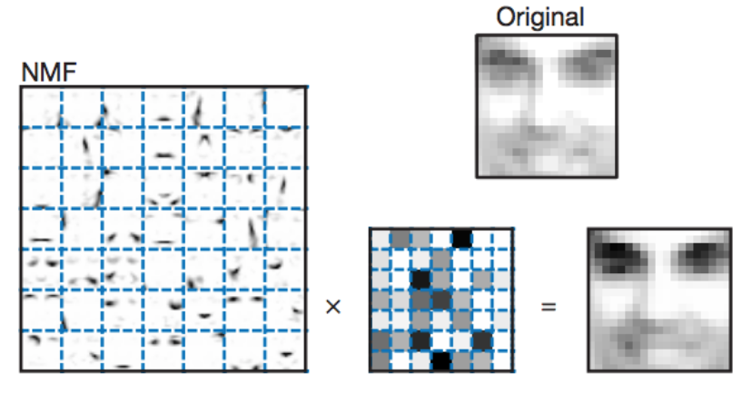
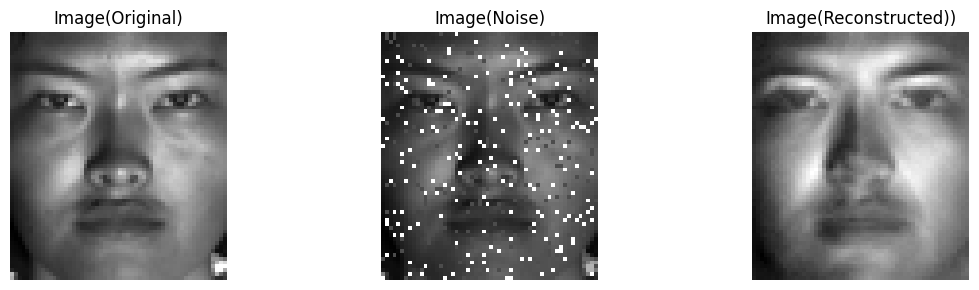
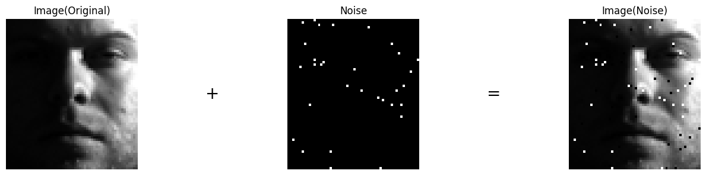
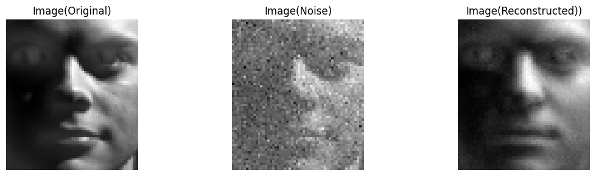

[English](README.md) | 中文版

<div align="center" style="font-weight: bold;">
  <a href="app.py">Demo</a>
</div>
<div align="center" style="font-weight: bold;">
  运行中...
</div>
<p align="center">
  
</p>
<div align="center" style="font-weight: bold;">
  结果
</div>
<p align="center">
  
</p>

深入体验我们技术的核心，通过实际操作来演示。只需在您的终端中启动此过程：

```bash
$ python app.py
```

通过几个简单的步骤直接与我们的算法互动：
- 步骤1. 在左侧选择您希望的参数；
- 步骤2. 点击`执行算法`；
- 步骤3. 期待在右侧获得您的定制化结果。

体验我们触手可及的解决方案。

# 用NumPy非负矩阵分解
- [快速开始](#rocket-快速开始)
- [1. 简介](#1-sparkles-简介)
- [2. 非负矩阵分解变体](#2-sparkles-非负矩阵分解变体)
- [3. 噪声类型](#3-sparkles-噪声类型)
- [4. 设置和执行](#4-sparkles-设置和执行)
- [5. 收敛趋势](#5-sparkles-收敛趋势)
- [6. 结果](#6-sparkles-结果)
  - [6.1. 指标](#61-指标)
    - [6.1.1. 它们是什么？](#611-它们是什么)
    - [6.1.2. 为什么均方根误差更重要？](#612-为什么均方根误差更重要)
  - [6.2. 在ORL和YaleB数据集上的性能](#62-在orl和yaleb数据集上的性能)
  - [6.3. 重建效果](#63-重建效果)
- [7. 项目结构](#7-sparkles-项目结构)
- [8. 更新日志 & TODO清单](#8-更新日志--todo清单)
- [9. 贡献](#9-handshake-贡献)

:pushpin: **重要提示**：
请确保在执行`run.py`前数据集文件置于`data`目录下。为了强调，我们已融合错误提示机制。另外，我们已经在代码中提供了全面的文档字符串和注释。如果您有任何疑问，自由地深入探索我们的源代码。

请勿故意输入非预期的数据类型来测试我们的算法。我们没有进行初步的输入类型检查，因此无法在一开始就拒绝不合适的输入。感谢您的理解！

### :rocket: 快速开始
1. 简洁性

要极速动手体验这个方法，只需简单配置和运行在`run.py`中的以下代码：

```python
from algorithm.pipeline import Pipeline

pipeline = Pipeline(nmf='L1NormRegularizedNMF', # Options: 'L2NormNMF', 'L1NormNMF', 'KLDivergenceNMF', 'ISDivergenceNMF', 'L21NormNMF', 'HSCostNMF', 'L1NormRegularizedNMF', 'CappedNormNMF', 'CauchyNMF'
                    dataset='YaleB', # Options: 'ORL', 'YaleB'
                    reduce=3, # ORL: 1, YaleB: 3
                    noise_type='salt_and_pepper', # Options: 'uniform', 'gaussian', 'laplacian', 'salt_and_pepper', 'block'
                    noise_level=0.08, # Uniform, Gassian, Laplacian: [.1, .3], Salt and Pepper: [.02, .10], Block: [10, 20]
                    random_state=99, # 0, 42, 99, 512, 3407 in our experiments
                    scaler='MinMax') # Options: 'MinMax', 'Standard'

# Run the pipeline
pipeline.run(max_iter=500, verbose=True) # Parameters: max_iter: int, convergence_trend: bool, matrix_size: bool, verbose: bool
pipeline.evaluate(idx=9, imshow=True) # Parameters: idx: int, imshow: bool
```

我们的开发框架助您只需几行代码即可轻松创建您自己的NMF算法。这里是您怎样开始:
```python
import numpy as np
from algorithm.nmf import BasicNMF
from algorithm.pipeline import Pipeline

class ExampleNMF(BasicNMF):
    # To tailor a unique NMF algorithm, subclass BasicNMF and redefine matrix_init and update methods.
    def matrix_init(self, X, n_components, random_state=None):
        # Implement your initialization logic here.
        # Although we provide built-in methods, crafting a bespoke initialization can markedly boost performance.
        # D, R = <your_initialization_logic>
        # D, R = np.array(D), np.array(R)
        return D, R  # Ensure D, R are returned.

    def update(self, X, **kwargs):
        # Implement the logic for iterative updates here.
        # Modify self.D, self.R as per your algorithm's logic.
        # flag = <convergence_criterion>
        return flag  # Return True if converged, else False.
```

用我们的流水线无缝测试您的算法的初步性能:
```python
pipeline = Pipeline(nmf=ExampleNMF(),
                    dataset='YaleB',
                    reduce=3,
                    noise_type='salt_and_pepper',
                    noise_level=0.08,
                    random_state=99,
                    scaler='MinMax')
```
为了一个完整的评估，贯穿我们的数据集进行试验:
```python
from algorithm.pipeline import Experiment

exp = Experiment()
# Once you build the data container
# You can choose an NMF algorithm and execute the experiment
exp.choose('L1NormRegularizedNMF')
# This step is very time-consuming, please be patient.
# If you achieve a better performance, congratulations! 
# You can share your results with us.
# Similarly, you can replace 'L1NormRegularizedNMF' with other your customized NMF algorithm
exp.execute()
```
注意: 这个 `Experiment` 函数接受表示内置算法的一个字符串或者一个 `BasicNMF` 对象，帮助您直接评价您自定义的NMF算法。

2. 便利性

我们诚邀您在 Google Colab 上尝试我们的实验。首先，在 `Setup` 部分执行所有代码片段，以访问我们的仓库。~~此外，您只需要上传 `data.zip` 文件即可~~。(您不再需要上传 `data.zip` 文件。)

实验环境设置完成后，您可以选择在终端中执行 `run.py`，或者根据需要调整默认设置，并在 Jupyter 笔记本中执行该脚本。

[](https://colab.research.google.com/github/XavierSpycy/NumPyNMF/blob/main/run.ipynb)

关于更全面的设置和具体的执行教程，请参考`设置和执行`部分。

## 1. :sparkles: 简介
NMF 是一种矩阵分解技术，其中要求分解后的所有矩阵元素都是非负的。这种分解方法尤其适用于那些元素都是非负的数据集，如图像数据或文本数据。

非负矩阵分解（NMF）目的在于解决以下的公式：

$$X \approx D R$$

<p align="center">
  
  <br>
  图 1. 非负矩阵分解演示
</p>

其中，如果 $X$ 的大小为 $m \times n$，通常 $D$ 的大小为 $m \times k$ 并且 $R$ 大小为 $k \times n$，其中 $k$ 是预先定义的因子数量，并且通常小于 $m$ 和 $n$ 。

NMF 在许多应用中都很有用，例如特征提取、图像处理和文本挖掘。

我们的实验为比较各种非负矩阵分解变种的稳健型（或鲁棒性）。

<p align="center">
  
  <br>
  Figure 2. 我们的实验演示
</p>

- **2个**数据集： ORL， Cropped YaleB              
- **8种**非负矩阵分解：基于 $L_2$ 范数（ $L_2$ Norm Based）， KL散度（KL Divergence），IS散度（IS Divergence），基于 $L_{2，1}$ 范数（ $L_{2，1}$ Norm Based），超表面损失（Hypersurface Cost），$L_1$ 范数正则（ $L_1$ Norm Regularized），基于Capped范数（Capped Norm Based）， 柯西（Cauchy）              
- **5种**噪声类型：均匀（Uniform）， 高斯（Gaussian），拉普拉斯（Laplacian），块状遮挡（Block Occlusion），椒盐（Salt and Pepper）

## 2. :sparkles: 非负矩阵分解变体
**提示**：GitHub本身不支持在Markdown预览中渲染LaTeX数学公式，部分公式可能无法正常显示。请您可以使用其他工具来查看这些公式。

- 基于 $L_2$ 范数（ $L_2$ Norm Based）非负矩阵分解
  - 损失函数：      
  $\lVert X - DR \rVert^2 = \sum_{\substack{ijk}}(x_{ij} - d_{ik}r_{kj})^2$
  - 更新规则:          
  $\mathbf{D} \leftarrow \mathbf{D} \times \frac{\mathbf{X} \mathbf{R^\top}}{\mathbf{D} \mathbf{R} \mathbf{R^\top}}\\   
  \mathbf{R} \leftarrow \mathbf{R} \times \frac{\mathbf{D^\top} \mathbf{X}}{\mathbf{D^\top} \mathbf{D} \mathbf{R}}$

- KL散度（KL Divergence）非负矩阵分解
  - 损失函数:      
  $d_{KL}(\mathbf{X} \lVert \mathbf{DR}) = \sum_{\substack{ijk}}(x_{ij}\mathrm{log}\frac{x_{ij}}{d_{ik}r_{kj}} - x_{ij} + d_{ik}r_{kj})$
  - 更新规则:      
  $\mathbf{D} \leftarrow \mathbf{D} \times \frac{(\frac{\mathbf{X}}{\mathbf{DR}})\mathbf{R}^\top}{\mathbf{1}_{m,n} \cdot \mathbf{R}^\top}\\
  \mathbf{R} \leftarrow \mathbf{R} \times \frac{\mathbf{D}^\top \left(\frac{\mathbf{X}}{\mathbf{DR}} \right)}{\mathbf{D}^\top \cdot \mathbf{1}_{m,n}}$

- IS散度（IS Divergence）非负矩阵分解
  - 损失函数:      
  $d_{IS}(\mathbf{X} \lVert \mathbf{DR}) = \frac{\mathbf{X}}{\mathbf{DR}} - \mathrm{log}\frac{\mathbf{X}}{\mathbf{DR}} - 1$
  - 更新规则:      
  $\mathbf{D} \leftarrow \mathbf{D} \times \frac{((\mathbf{DR}^{-2}) \mathbf{X})\mathbf{R}^\top}{(\mathbf{DR})^{-1} \mathbf{R}^\top}\\
  \mathbf{R} \leftarrow \mathbf{R} \times \frac{\mathbf{D}^\top ((\mathbf{DR})^{-2}\mathbf{X})}{\mathbf{D}^\top (\mathbf{DR})^{-1}}$

- 基于 $L_{2,1}$ 范数（ $L_{2,1}$ Norm Based）非负矩阵分解
  - 损失函数:      
  $\lVert \mathbf{X - DR} \rVert_{2,1} = \sum_{\substack{i=1}}^n \sqrt{\sum_{\substack{j=1}^p}(\mathbf{X} - \mathbf{DR})_{ji}^2}  = \sum_{\substack{i=1}}^n \lVert x_i - \mathbf{D}r_i \rVert$
  - 更新规则:      
  $D_{ji} \leftarrow D_{jk} \times \frac{(\mathbf{X \Lambda R^\top})_{jk}}{(\mathbf{DR\Lambda R^\top})_jk} \\
  R_{ki} \leftarrow R_{ki} \times \frac{(\mathbf{D^\top X\Lambda})_{ki}}{(\mathbf{D^\top DR\Lambda})_{jk}}\\
  $
  where $\Lambda$ is a diagonal matrix with the diagonal elements given by,    
  $D_{ii} = \frac{1}{\sqrt{\sum_{\substack{j=1}}^p(\mathbf{X - DR})_{ji}^2}} = \frac{1}{\lVert x_i - \mathbf{D}r_i \rVert}$

- 超表面损失（Hypersurface Cost）非负矩阵分解
  - 损失函数:
  $\phi(\mathbf{D},\mathbf{R}) = \frac{1}{2}(\sqrt{1 + \lVert \mathbf{X} - \mathbf{DR} \rVert^2} - 1)$
  - 更新规则:      
  $\mathbf{D} \leftarrow \mathbf{D} - \alpha\frac{\mathbf{DRR}^{\top} - \mathbf{XR}^{\top}}{\sqrt{1 + \lVert \mathbf{X} - \mathbf{DR} \rVert}}\\
  \mathbf{R} \leftarrow \mathbf{R} - \beta \frac{\mathbf{D}^{\top}\mathbf{DR} - \mathbf{D}^{\top}\mathbf{X}}{\sqrt{1 + \lVert \mathbf{X} - \mathbf{DR} \rVert}}$

- $L_1$ 范数正则（ $L_1$ Norm Regularized）非负矩阵分解
  - 损失函数:
  $\lVert \mathbf{X} - \mathbf{DR} - \mathbf{S}\rVert_F^2 + \lambda \lVert S \rVert_1$
  - 更新规则:      
  $\mathbf{S} \leftarrow \mathbf{X} - \mathbf{DR}\\
  \mathbf{S}_{ij} \leftarrow 
    \begin{cases}
        \mathbf{S}_{ij} - \frac{\lambda}{2} \text{  ,if} \mathbf{S}_{ij} > \frac{\lambda}{2} \\
        \mathbf{S}_{ij} + \frac{\lambda}{2} \text{  ,if} \mathbf{S}_{ij} < \frac{\lambda}{2}\\
        0 \text{    ,otherwise}
    \end{cases}\\
    \mathbf{D} \leftarrow \frac{\left | (\mathbf{S} - \mathbf{X})\mathbf{R}^{\top}\right | - ((\mathbf{S} - \mathbf{X})\mathbf{R}^{\top}}{2\mathbf{DRR}^{\top}}\\
    \mathbf{R} \leftarrow \frac{\left |\mathbf{D}^{\top}(\mathbf{S} - \mathbf{X})\right | - (\mathbf{D}^{\top}(\mathbf{S} - \mathbf{X})}{2\mathbf{D^{\top}}\mathbf{DR}}\\
    \mathbf{D} \leftarrow \frac{\mathbf{D}}{\sqrt{\sum^n_{k=1}\mathbf{D}_{kj}^2}}\\
    \mathbf{R} \leftarrow \mathbf{R}\sqrt{\sum^n_{k=1}\mathbf{D}_{kj}^2}$

- 基于Capped范数（Capped Norm Based）非负矩阵分解
  - 更新规则:     
  $\mathbf{D} \leftarrow \mathbf{D}\frac{\mathbf{XIR}^\top}{\mathbf{DRIR}^{\top}}\\
  \mathbf{R} \leftarrow \mathbf{R}\sqrt{\frac{\mathbf{IXD}}{\mathbf{IR}^{\top}\mathbf{RXD}}}\\
  \mathbf{I}_{jj} = 
    \begin{cases} \frac{1}{2\lVert x_j - \mathbf{D}r_j\rVert_2}\text{   ,if} \lVert x_j - \mathbf{D}r_j\rVert \leq \theta \\
    0 \text{    ,otherwise}
    \end{cases}$,     
    where $\mathbf{I}$ is initialized as an identify mamtrix and then will be updated to a diagonal matrix.

- 柯西（Cauchy）非负矩阵分解
  - 更新规则:         
  $\theta \leftarrow \theta \cdot \frac{b_\theta}{a_\theta + \sqrt{a_\theta^2 + 2b_\theta \cdot a_\theta}}$     
  For $\mathbf{D}$,    
  $a_\theta =  \frac{3}{4} \frac{\sigma}{\sigma^2 + \mathbf{X}} \mathbf{R}^\top\\
  b_\theta = \sigma^{-1}\mathbf{R}^\top$;     
  For $\mathbf{R}$,    
  $a_\theta = \frac{3}{4}\mathbf{D}^{\top}\frac{\sigma}{\sigma^2 + \mathbf{X}}\\
   b_\theta = \mathbf{D}^{\top}\sigma^{-1}$

## 3. :sparkles: 噪声类型
- 均匀:
<p align="center">
  
  <br>
  图 3. 均匀噪声
</p>

- 高斯
<p align="center">
  
  <br>
  图 4. 高斯噪声
</p>

- 拉普拉斯
<p align="center">
  
  <br>
  图 5. 拉普拉斯噪声
</p>

- 块状遮挡
<p align="center">
  
  <br>
  图 6. 块状噪声
</p>

- 椒盐
<p align="center">
  
  <br>
  图 7. 椒盐噪声
</p>

## 4. :sparkles: 设置和执行
### 步骤1. 实验设置
**如果您不担心包版本冲突，您可以跳过这一步。**

为了避免包版本之间的冲突，我们只确保在我们特定包版本下顺利执行。我们无法保证在所有相关包中都完美运作。但是，如果您有担忧或者希望最高的兼容性，您可以跟随下面的步骤来创建一个专为该实验的新环境。

1. **创建一个新的Conda环境：**

   首先，您要创建一个新的名为`NumPyNMF`的Conda环境。为了做到这点，打开您的终端或者命令提示，并输入以下的命令：

   ```bash
   $ conda create --name NumPyNMF python=3.8
   ```

2. **激活这个新环境：**

    在安装任何包或运行任何脚本前，您必须激活这个环境。为了做到这点，输入以下命令：
    ```bash
    $ conda activate NumPyNMF
    ```

3. **安装必要的包：**

    导航到`requirements.txt`文件所在目录并用`pip`安装必要的包：
    ```bash
    $ pip install -r requirements.txt
    ```
4. **运行实验**

    在设置环境并安装必要的包后，确保在执行任何脚本前，`NumPyNMF`环境始终被激活。

**重要**: 如前所提，我们已定制这个环境来避免潜在的版本冲突，以确保和我们代码最优的兼容性。请使用这个环境来确保准确和无冲突的执行。

### 步骤2. 实验执行

要运行当前实验，遵循这些步骤：

1. **Configure the Algorithm and Dataset:** 在`run.py`中，我们提供一个`Pipeline`类。您可以通过调整参数来配置您的实验。这里有一则`Pipeline`参数的解释。 

    - `nmf`：选择想要的非负矩阵分解（NMF）算法。可选项有：`L2NormNMF`，`L1NormNMF`，`KLdivergenceNMF`，`ISdivergenceNMF`，`RobustNMF`，`HypersurfaceNMF`，`L1NormRegularizedNMF`，`CappedNormNMF`，`CauchyNMF`。
    
    - `dataset`：选择数据集。可选性有：`ORL`，`YaleB`。
    
    - `reduce`：在我们的实验中，对于`ORL`用`1`，对于`YaleB`用`3`。若这个值过小，则执行时间会过多；若过大，则它会导致信息丢失。
    
    - `noise_type`： 噪声类型。 可选项有：`uniform`，`gaussian`，`laplacian`，`salt_and_pepper`，`block`。
    
    - `noise_level`： 噪声等级。这个特定值根据您所选择的噪声类型而改变。
    
    - `random_state`： 实验中所用的随机种子值。在我们的实验中，我们用的：`0`，`42`，`99`，`512`，`3407`。
    
    - `scaler`: 数据标准化方法。可选项有：`MinMax`，`Standard`。

2. **运行流程：**
    ```python
    pipeline.run() 
    ```
    可选参数包括：`max_iter` （最大迭代次数），`convergence_trend` （是否显示收敛趋势），`matrix_size` （是否显示矩阵形状），以及`verbose` （是否显示训练过程）。

3. **评价结果：**
    ```python
    pipeline.evaluate()
    ```
    可选参数有：`idx` （索引）和`imshow`（是否显示图像）。

### 步骤3：在终端运行脚本

在您已经在`run.py`脚本中配置好实验参数后，您可以直接从终端执行实验。遵循这些步骤:

1. **导航至目录：**
   
   首先，确保您在`run.py`文件所在目录。用`cd`命令，紧接着目录路径以定位。例如：
   ```bash
   $ cd path/to/your/directory/NumPyNMF
   ```

2. **执行脚本：**

    用Python运行脚本。依赖于您的设置，您可以用python，python3或其他变种。这里是一个通用命令：
    ```bash
    $ python run.py
    ```
  
    如果您准备专门使用Python 3并同时安装Python 2和Python 3，您可以使用：
    ```bash
    $ python3 run.py
    ```

希望这能帮助您顺利进行实验！

## 5. :sparkles: 收敛趋势
</p>

- 基于 $L_1$ 范数非负矩阵分解:
<p align="center">
  
  <br>
  图 8. 基于L<sub>1</sub>范数非负矩阵分解的收敛趋势
</p>


- 基于 $L_{2，1}$ 范数非负矩阵分解:
<p align="center">
  
  <br>
  图 9. 基于L<sub>2，1</sub>范数非负矩阵分解的收敛趋势
</p>

## 6. :sparkles: 结果
### 6.1 指标
#### 6.1.1. 它们是什么？
- 均方根误差 (以下简称：RMSE)     
$\mathrm{RMSE} = \sqrt{\frac{1}{N} \lVert \mathbf{X - DR} \rVert^2_F}$
- 平均准确率      
$\mathrm{Acc(Y,Y_{pred})} = \frac{1}{n} \sum_{\substack{i}}^n \{\mathrm{{Y_{(pred)(i)}}} = \mathrm{Y(i)}\}$
- 标准化互信息 (以下简称：NMI)     
$\mathrm{标准化互信息(Y,Y_{pred})} = \frac{2 \times I(\mathrm{Y,Y_{pred}})}{H(\mathrm{Y}) + H(\mathrm{Y_{pred})}}$,     
where $I(\cdot,\cdot$) is the mutual information,$H(\cdot)$ is the entropy.

#### 6.1.2. 为什么均方根误差更重要？

<p align="center">
  
  <br>
  图 10. 更大的均方根误差，平均准确率和标准化互信息
</p>

<p align="center">
  
  <br>
  图 11. 更小的均方根误差，平均准确率和标准化互信息
</p>

如图10所示，重建图片展现出了更高水平的颗粒度。

### 6.2. 在ORL和YaleB数据集上的性能
在我们的预实验中，我们观察到某些非负矩阵分解可能在特定的数据集上表现得不好。这可能归咎于：
- 数据集的内在特性。
- 潜在实现错误（我们将此留在未来的工作中）。

我们热烈欢迎您深入我们的源代码并对其做出贡献。

<style>
    table, th, td {
        border: 1px solid black;
        text-align: center;
    }
</style>
<table border="1">
    <thead>
        <tr>
            <th rowspan="2">Dataset</th>
            <th rowspan="2">Noise Type</th>
            <th rowspan="2">Noise Level</th>
            <th rowspan="2">Metrics</th>
            <th colspan="9">NMF Algorithm</th>
        </tr>
        <tr>
            <th><i>L<sub>2</sub></i> Norm</th>
            <th>KL Divergence</th>
            <th><i>L<sub>2,1</sub></i> Norm</th>
            <th><i>L<sub>1</sub></i> Norm Regularized</th>
            <th>CappedNorm</th>
        </tr>
    </thead>
    <tbody>
        <tr>
            <td rowspan="30">ORL</td>
            <td rowspan="6">Uniform</td>
            <td rowspan="3">0.1</td>
            <td>RMSE</td>
            <td>.1112(.0005)</td>
            <td>.1108(.0005)</td>
            <td>.1116(.0004)</td>
            <td>.1125(.0006)</td>
            <td>.2617(.0035)</td>
        </tr>
        <tr>
            <td>Accuracy</td>
            <td>.6111(.0394)</td>
            <td>.5911(.0424)</td>
            <td>.5956(.0458)</td>
            <td>.6806(.0275)</td>
            <td>.6883(.0262)</td>
        </tr>
        <tr>
            <td>NMI</td>
            <td>.7696(.0244)</td>
            <td>.7580(.0320)</td>
            <td>.7633(.0295)</td>
            <td>.8210(.0155)</td>
            <td>.8316(.0120)</td>
        </tr>
        <tr>
            <td rowspan="3">0.3</td>
            <td>RMSE</td>
            <td>.2410(.0017)</td>
            <td>.2403(.0018)</td>
            <td>.2411(.0018)</td>
            <td>.2447(.0019)</td>
            <td>.1569(.0011)</td>
        </tr>
        <tr>
            <td>Accuracy</td>
            <td>.5661(.0126)</td>
            <td>.5650(.0345)</td>
            <td>.5461(.0201)</td>
            <td>.6478(.0168)</td>
            <td>.6639(.0182)</td>
        </tr>
        <tr>
            <td>NMI</td>
            <td>.7450(.0061)</td>
            <td>.7353(.0316)</td>
            <td>.7540(.0262)</td>
            <td>.8051(.0143)</td>
            <td>.8170(.0095)</td>
        </tr>
        <td rowspan="6">Gaussian</td>
            <td rowspan="3">0.05</td>
            <td>RMSE</td>
            <td>.1119(.0140)</td>
            <td>.1116(.0139)</td>
            <td>.1121(.0140)</td>
            <td>.1139(.0139)</td>
            <td>.2699(.0182)</td>
        </tr>
        <tr>
            <td>Accuracy</td>
            <td>.5683(.0116)</td>
            <td>.5494(.0332)</td>
            <td>.5983(.0472)</td>
            <td>.6750(.0393)</td>
            <td>.6889(.0283)</td>
        </tr>
        <tr>
            <td>NMI</td>
            <td>.7372(.0073)</td>
            <td>.7249(.0233)</td>
            <td>.7540(.0262)</td>
            <td>.8153(.0264)</td>
            <td>.8306(.0131)</td>
        </tr>
        <tr>
            <td rowspan="3">0.08</td>
            <td>RMSE</td>
            <td>.2255(.0380)</td>
            <td>.2249(.0380)</td>
            <td>.2256(.0380)</td>
            <td>.2278(.0377)</td>
            <td>.1710(.0255)</td>
        </tr>
        <tr>
            <td>Accuracy</td>
            <td>.5706(.0377)</td>
            <td>.5767(.0364)</td>
            <td>.5750(.0434)</td>
            <td>.6389(.0316)</td>
            <td>.6717(.0366)</td>
        </tr>
        <tr>
            <td>NMI</td>
            <td>.7519(.0212)</td>
            <td>.7454(.0209)</td>
            <td>.7519(.0341)</td>
            <td>.7965(.0225)</td>
            <td>.8089(.0176)</td>
        </tr>
        <td rowspan="6">Laplcian</td>
            <td rowspan="3">0.04</td>
            <td>RMSE</td>
            <td>.1113(.0085)</td>
            <td>.1110(.0084)</td>
            <td>.1117(.0085)</td>
            <td>.1125(.0083)</td>
            <td>.2642(.0135)</td>
        </tr>
        <tr>
            <td>Accuracy</td>
            <td>.6050(.0296)</td>
            <td>.5783(.0245)</td>
            <td>.5983(.0190)</td>
            <td>.6817(.0257)</td>
            <td>.7044(.0138)</td>
        </tr>
        <tr>
            <td>NMI</td>
            <td>.7719(.0212)</td>
            <td>.7482(.0199)</td>
            <td>.7688(.0161)</td>
            <td>.8184(.0137)</td>
            <td>.8329(.0083)</td>
        </tr>
        <tr>
            <td rowspan="3">0.06</td>
            <td>RMSE</td>
            <td>.2496(.0488)</td>
            <td>.2491(.0488)</td>
            <td>.2497(.0488)</td>
            <td>.2505(.0486)</td>
            <td>.1464(.0351)</td>
        </tr>
        <tr>
            <td>Accuracy</td>
            <td>.5700(.0427)</td>
            <td>.5967(.0316)</td>
            <td>.6083(.0578)</td>
            <td>.6783(.0187)</td>
            <td>.7050(.0265)</td>
        </tr>
        <tr>
            <td>NMI</td>
            <td>.7463(.0148)</td>
            <td>.7600(.0275)</td>
            <td>.7681(.0377)</td>
            <td>.8208(.0066)</td>
            <td>.8329(.0107)</td>
        </tr>
        <td rowspan="6">Salt and Pepper</td>
            <td rowspan="3">0.02</td>
            <td>RMSE</td>
            <td>.0859(.0005)</td>
            <td>.0856(.0003)</td>
            <td>.0864(.0004)</td>
            <td>.0823(.0003)</td>
            <td>.3253(.0037)</td>
        </tr>
        <tr>
            <td>Accuracy</td>
            <td>.5683(.0172)</td>
            <td>.5833(.0315)</td>
            <td>.5867(.0322)</td>
            <td>.6689(.0180)</td>
            <td>.7056(.0322)</td>
        </tr>
        <tr>
            <td>NMI</td>
            <td>.7463(.0148)</td>
            <td>.7427(.0163)</td>
            <td>.7521(.0230)</td>
            <td>.8116(.0050)</td>
            <td>.8394(.0134)</td>
        </tr>
        <tr>
            <td rowspan="3">0.1</td>
            <td>RMSE</td>
            <td>.1141(.0016)</td>
            <td>.1100(.0013)</td>
            <td>.1142(.0017)</td>
            <td>.0920(.0017)</td>
            <td>.2941(.0044)</td>
        </tr>
        <tr>
            <td>Accuracy</td>
            <td>.5178(.0434)</td>
            <td>.5356(.0306)</td>
            <td>.5033(.0487)</td>
            <td>.6306(.0288)</td>
            <td>.5850(.0257)</td>
        </tr>
        <tr>
            <td>NMI</td>
            <td>.7244(.0221)</td>
            <td>.7242(.0193)</td>
            <td>.7166(.0318)</td>
            <td>.8016(.0182)</td>
            <td>.7828(.0113)</td>
        </tr>
        <td rowspan="6">Block</td>
            <td rowspan="3">10</td>
            <td>RMSE</td>
            <td>.1064(.0007)</td>
            <td>.0989(.0005)</td>
            <td>.1056(.0007)</td>
            <td>.0828(.0003)</td>
            <td>.3276(.0030)</td>
        </tr>
        <tr>
            <td>Accuracy</td>
            <td>.4472(.0354)</td>
            <td>.4961(.0359)</td>
            <td>.4772(.0299)</td>
            <td>.6606(.0271)</td>
            <td>.6261(.0172)</td>
        </tr>
        <tr>
            <td>NMI</td>
            <td>.6381(.0283)</td>
            <td>.6744(.0323)</td>
            <td>.6673(.0299)</td>
            <td>.8116(.0132)</td>
            <td>.7721(.0061)</td>
        </tr>
        <tr>
            <td rowspan="3">15</td>
            <td>RMSE</td>
            <td>.1531(.0019)</td>
            <td>.1390(.0021)</td>
            <td>.1517(.0019)</td>
            <td>.1104(.0052)</td>
            <td>.3401(.0018)</td>
        </tr>
        <tr>
            <td>Accuracy</td>
            <td>.3633(.0161)</td>
            <td>.4150(.0511)</td>
            <td>.3656(.0349)</td>
            <td>.5783(.0282)</td>
            <td>.3028(.0228)</td>
        </tr>
        <tr>
            <td>NMI</td>
            <td>.5528(.0208)</td>
            <td>.6101(.0335)</td>
            <td>.5627(.0314)</td>
            <td>.7513(.0200)</td>
            <td>.4863(.0256)</td>
        </tr>
        <tr>
            <td rowspan="30">YaleB</td>
            <td rowspan="6">Uniform</td>
            <td rowspan="3">0.1</td>
            <td>RMSE</td>
            <td>.1232(.0005)</td>
            <td>.1227(.0004)</td>
            <td>.1235(.0005)</td>
            <td>.1235(.0004)</td>
            <td>.1044(.0003)</td>
        </tr>
        <tr>
            <td>Accuracy</td>
            <td>.1878(.0102)</td>
            <td>.1899(.0055)</td>
            <td>.1890(.0089)</td>
            <td>.1562(.0040)</td>
            <td>.1632(.0066)</td>
        </tr>
        <tr>
            <td>NMI</td>
            <td>.2674(.0154)</td>
            <td>.2586(.0124)</td>
            <td>.2599(.0135)</td>
            <td>.2399(.0136)</td>
            <td>.2064(.0137)</td>
        </tr>
        <tr>
            <td rowspan="3">0.3</td>
            <td>RMSE</td>
            <td>.3102(.0014)</td>
            <td>.3089(.0015)</td>
            <td>.3100(.0015)</td>
            <td>.3128(.0016)</td>
            <td>.2571(.0348)</td>
        </tr>
        <tr>
            <td>Accuracy</td>
            <td>.1641(.0307)</td>
            <td>.1819(.0265)</td>
            <td>.1706(.0300)</td>
            <td>.1316(.0086)</td>
            <td>.1327(.0097)</td>
        </tr>
        <tr>
            <td>NMI</td>
            <td>.2382(.0404)</td>
            <td>.2551(.0333)</td>
            <td>.2458(.0363)</td>
            <td>.1682(.0205)</td>
            <td>.1573(.0215)</td>
        </tr>
        <td rowspan="6">Gaussian</td>
            <td rowspan="3">0.05</td>
            <td>RMSE</td>
            <td>1.1221(.3938)</td>
            <td>1.1219(.3938)</td>
            <td>1.1221(.3938)</td>
            <td>1.1216(.3936)</td>
            <td>1.1160(.3902)</td>
        </tr>
        <tr>
            <td>Accuracy</td>
            <td>.1334(.0264)</td>
            <td>.1362(.0264)</td>
            <td>.1359(.0244)</td>
            <td>.1174(.0135)</td>
            <td>.1276(.0133)</td>
        </tr>
        <tr>
            <td>NMI</td>
            <td>.1922(.0511)</td>
            <td>.1865(.0492)</td>
            <td>.1840(.0581)</td>
            <td>.1357(.0344)</td>
            <td>.1416(.0134)</td>
        </tr>
        <tr>
            <td rowspan="3">0.08</td>
            <td>RMSE</td>
            <td>3.0621(.9219)</td>
            <td>3.0620(.9220)</td>
            <td>3.0621(.9219)</td>
            <td>3.0583(.9171)</td>
            <td>2.9515(.9138)</td>
        </tr>
        <tr>
            <td>Accuracy</td>
            <td>.0864(.0965)</td>
            <td>.0855(.0146)</td>
            <td>.0843(.0151)</td>
            <td>.0843(.0105)</td>
            <td>.0877(.0126)</td>
        </tr>
        <tr>
            <td>NMI</td>
            <td>.0965(.0396)</td>
            <td>.0925(.0338)</td>
            <td>.0956(.0361)</td>
            <td>.0775(.0146)</td>
            <td>.0794(.0192)</td>
        </tr>
        <td rowspan="6">Laplcian</td>
            <td rowspan="3">0.04</td>
            <td>RMSE</td>
            <td>1.6705(.6822)</td>
            <td>1.6703(.6822)</td>
            <td>1.6705(.6822)</td>
            <td>1.6692(.6817)</td>
            <td>1.6707(.6771)</td>
        </tr>
        <tr>
            <td>Accuracy</td>
            <td>.1208(.0261)</td>
            <td>.1197(.0262)</td>
            <td>.1188(.0294)</td>
            <td>.1017(.0169)</td>
            <td>.1166(.0123)</td>
        </tr>
        <tr>
            <td>NMI</td>
            <td>.1649(.0569)</td>
            <td>.1667(.0407)</td>
            <td>.1564(.0499)</td>
            <td>.1175(.0443)</td>
            <td>.1214(.0208)</td>
        </tr>
        <tr>
            <td rowspan="3">0.06</td>
            <td>RMSE</td>
            <td>4.3538(1.5452)</td>
            <td>4.3537(1.5452)</td>
            <td>4.3538(1.5452)</td>
            <td>4.3414(1.5343)</td>
            <td>4.2264(1.5424)</td>
        </tr>
        <tr>
            <td>Accuracy</td>
            <td>.0739(.0091)</td>
            <td>.0720(.0083)</td>
            <td>.0727(.0080)</td>
            <td>.0959(.0134)</td>
            <td>.0855(.0119)</td>
        </tr>
        <tr>
            <td>NMI</td>
            <td>.0658(.0259)</td>
            <td>.0638(.0263)</td>
            <td>.0602(.0174)</td>
            <td>.0988(.0181)</td>
            <td>.0764(.0193)</td>
        </tr>
        <td rowspan="6">Salt and Pepper</td>
            <td rowspan="3">0.02</td>
            <td>RMSE</td>
            <td>.0749(.0004)</td>
            <td>.0765(.0004)</td>
            <td>.0749(.0003)</td>
            <td>.0738(.0002)</td>
            <td>.1495(.0005)</td>
        </tr>
        <tr>
            <td>Accuracy</td>
            <td>.1903(.0091)</td>
            <td>.1852(.0106)</td>
            <td>.1959(.0139)</td>
            <td>.1575(.0055)</td>
            <td>.1730(.0070)</td>
        </tr>
        <tr>
            <td>NMI</td>
            <td>.2705(.0154)</td>
            <td>.2556(.0113)</td>
            <td>.2736(.0329)</td>
            <td>.2436(.0135)</td>
            <td>.2228(.0166)</td>
        </tr>
        <tr>
            <td rowspan="3">0.1</td>
            <td>RMSE</td>
            <td>.1213(.0020)</td>
            <td>.1100(.0009)</td>
            <td>.1214(.0018)</td>
            <td>.0779(.0026)</td>
            <td>.1467(.0238)</td>
        </tr>
        <tr>
            <td>Accuracy</td>
            <td>.1365(.0082)</td>
            <td>.1565(.0047)</td>
            <td>.1313(.0050)</td>
            <td>.1506(.0061)</td>
            <td>.1308(.0108)</td>
        </tr>
        <tr>
            <td>NMI</td>
            <td>.1971(.0151)</td>
            <td>.2115(.0163)</td>
            <td>.1750(.0114)</td>
            <td>.2217(.0101)</td>
            <td>.1586(.0106)</td>
        </tr>
        <td rowspan="6">Block</td>
            <td rowspan="3">10</td>
            <td>RMSE</td>
            <td>.1717(.0009)</td>
            <td>.1560(.0006)</td>
            <td>.1706(.0007)</td>
            <td>.1124(.0060)</td>
            <td>.1854(.0126)</td>
        </tr>
        <tr>
            <td>Accuracy</td>
            <td>.0994(.0072)</td>
            <td>.1123(.0118)</td>
            <td>.0917(.0035)</td>
            <td>.1210(.0113)</td>
            <td>.0941(.0079)</td>
        </tr>
        <tr>
            <td>NMI</td>
            <td>.1055(.0070)</td>
            <td>.1256(.0106)</td>
            <td>.0947(.0042)</td>
            <td>.1730(.0160)</td>
            <td>.0963(.0090)</td>
        </tr>
        <tr>
            <td rowspan="3">15</td>
            <td>RMSE</td>
            <td>.2669(.0013)</td>
            <td>.2594(.0014)</td>
            <td>.2664(.0013)</td>
            <td>.2540(.0010)</td>
            <td>.2542(.0069)</td>
        </tr>
        <tr>
            <td>Accuracy</td>
            <td>.0813(.0029)</td>
            <td>.0948(.0047)</td>
            <td>.0846(.0058)</td>
            <td>.0766(.0038)</td>
            <td>.0811(.0017)</td>
        </tr>
        <tr>
            <td>NMI</td>
            <td>.0748(.0080)</td>
            <td>.1068(.0133)</td>
            <td>.0845(.0170)</td>
            <td>.0731(.0079)</td>
            <td>.0747(.0021)</td>
        </tr>
    </tbody>
</table>

### 6.3. 重建效果
- 高斯噪声重建
<p align="center">
  
  <br>
  图 12. 高斯噪声重建 (噪声水平: 0.16)
</p>

- 拉普拉斯噪声重建
<p align="center">
  
  <br>
  图 13. 拉普拉斯噪声重建 (噪声水平: 0.1)
</p>

- 均匀噪声重建
<p align="center">
  
  <br>
  图 14. 均匀噪声重建 (噪声水平: 0.1)
</p>

- 块状遮挡噪声重建
<p align="center">
  
  <br>
  图 15. 块状遮挡噪声重建 (块状大小: 10)
</p>

<p align="center">
  
  <br>
  图 16. 块状遮挡噪声重建（块状大小：20）
</p>

- 椒盐噪声重建
<p align="center">
  
  <br>
  图 17. 椒盐噪声重建（噪声水平：0.1）
</p>

## 7. :sparkles: 项目结构
```
├── NumPyNMF/
│   ├── algorithm/
│   │   ├── __init__.py
│   │   ├── datasets.py
│   │   ├── nmf.py
│   │   ├── pipeline.py
│   │   ├── preprocess.py
│   │   ├── sample.py
│   │   ├── trainer.py
│   │   ├── user_evaluate.py
│   │   └── visualize.py
│   └── data/
│       ├── CroppedYaleB/
│       └── ORL/
├── figures/*.png
├── .gitignore
├── LICENSE
├── README.md
├── README.zh-CN.md
├── requirements.txt
├── run.ipynb
└── run.py
```

## 8. 更新日志 & TODO清单
- 2023-10-20      
    - TODO清单:
        - NumPy内存预分配 :x: (与可读性冲突)
        - 算法故障原因 (已完成: 2023-11-24)
        - GUI界面 (已完成: 2024-02-01)
- 2023-11-10
    - 更新日志:
        - 提升`algorithm.NMF`模块
        - 修复部分算法故障
- 2023-11-24
    - 更新日志:
        - 丢弃一些模块并退耦`algorithm.nmf`，使其对用户和迁移至其他任务更灵活
        - 整合丢弃的模块中的基础函数至`BasicNMF`
- 2024-02-01
    - 更新日志: 
        - 发布用户交互脚本
        - 引入高阶技巧
        - 分步流式化过程
- 2024-02-07
    - 更新日志:
        - 构建利用多进程技术的实验, 导致显著加速
        - 新增实验中的日志记录

## 9. :handshake: 贡献
我们欢迎任何形式的贡献，无论是提出新功能的建议，报告bug，还是帮助优化代码。以下是开始的步骤：

### 1. Fork项目:
- 通过点击GitHub页面上的“Fork”按钮，将此项目复制到您的GitHub帐户。

### 2. 克隆你的Fork:
```bash
git clone https://github.com/YOUR_USERNAME/PROJECT_NAME.git
```

然后进入项目目录：
```bash
cd PROJECT_NAME
```
### 3. 创建一个新的分支:
- 基于您想要做的更改为您的分支命名，例如，`feature/new-feature`或`bugfix/issue-name`:
```bash
git checkout -b branch-name
```

### 4. 提交您的更改:
- 在此分支上做出您的更改，然后提交它们。
  ```bash
  git add .
  git commit -m "Describe your changes here"
  ```
### 5. 将分支推送到您的Fork:
```bash
git push origin branch-name
```

### 6. 提交一个拉取请求:
- 返回到您fork的GitHub页面，并点击“New Pull Request”。选择您刚刚推送的分支，然后提交拉取请求。

### 7. 等待审议:
- 项目维护者会审查您的拉取请求。他们可能会请求一些更改或对其进行合并。