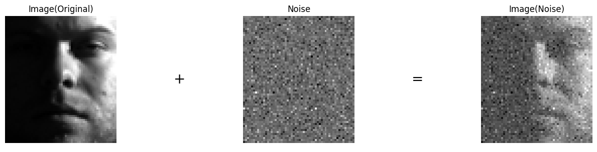
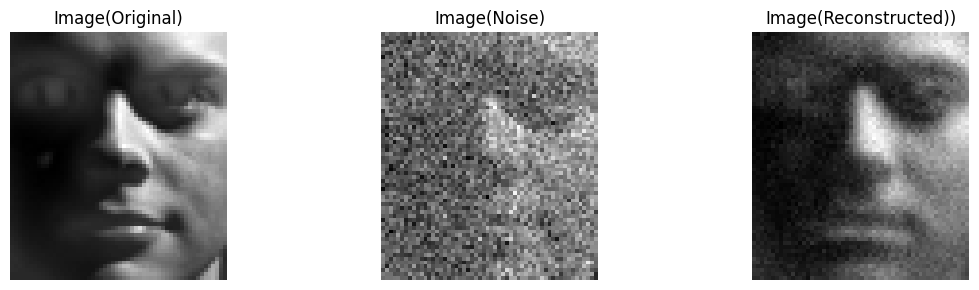
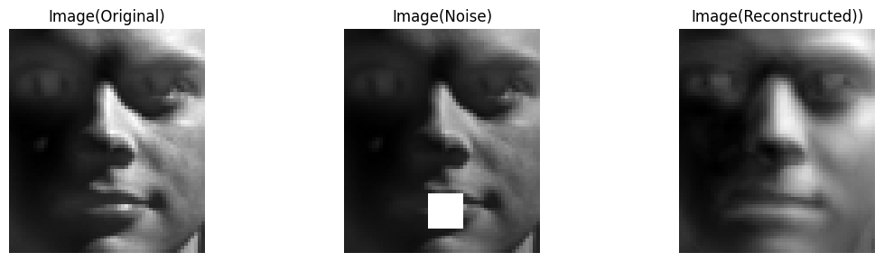

[English](README.md) | 中文版
# 用NumPy非负矩阵分解
- [快速开始](#rocket-快速开始)
- [1. 简介](#1-sparkles-简介)
- [2. 非负矩阵分解变体](#2-sparkles-非负矩阵分解变体)
- [3. 噪声类型](#3-sparkles-噪声类型)
- [4. 设置和执行](#4-sparkles-设置和执行)
- [5. 收敛趋势](#5-sparkles-收敛趋势)
- [6. 结果](#6-sparkles-结果)
  - [6.1. 指标](#61-指标)
    - [6.1.1. 它们是什么？](#611-它们是什么)
    - [6.1.2. 为什么均方根误差更重要？](#612-为什么均方根误差更重要)
  - [6.2. 在ORL和YaleB数据集上的性能](#62-在orl和yaleb数据集上的性能)
  - [6.3. 重建效果](#63-重建效果)
- [7. 项目结构](#7-sparkles-项目结构)
- [8. TODO](#8-todo)
- [9. 贡献](#9-handshake-贡献)

:pushpin: **重要提示**：
请确保在执行`run.py`前数据集文件置于`data`目录下。为了强调，我们已融合错误提示机制。另外，我们已经在代码中提供了全面的文档字符串和注释。如果您有任何疑问，自由地深入探索我们的源代码。

请勿故意输入非预期的数据类型来测试我们的算法。我们没有进行初步的输入类型检查，因此无法在一开始就拒绝不合适的输入。感谢您的理解！

### :rocket: 快速开始
1. 简洁性

要极速动手体验这个方法，只需简单配置和运行在`run.py`中的以下代码：

```python
from algorithm.pipeline import Pipeline

pipeline = Pipeline(nmf='L1NormRegularizedNMF',# Options: 'L2NormNMF','L1NormNMF','KLdivergenceNMF','ISdivergenceNMF','RobustNMF','HypersurfaceNMF','L1NormRegularizedNMF','CappedNormNMF','CauchyNMF'
                    dataset='ORL',# Options: 'ORL','YaleB'
                    reduce=1,# ORL: 1,YaleB: 3
                    noise_type='uniform',# Options: 'uniform','gaussian','laplacian','salt_and_pepper','block'
                    noise_level=0.02,# Uniform,Gassian,Laplacian: [.1,.3],Salt and Pepper: [.02,.10],Block: [10,20]
                    random_state=3407,# 0,42,99,512,3407 in our experiments
                    scaler='MinMax') # Options: 'MinMax','Standard'

# Run the pipeline
pipeline.run() # Parameters: max_iter: int,convergence_trend: bool,matrix_size: bool
pipeline.evaluate() # Parameters: idx: int,imshow: bool
```

2. 便利性

我们诚邀您在 Google Colab 上尝试我们的实验。首先，在 `Setup` 部分执行所有代码片段，以访问我们的仓库。此外，您只需要上传 `data.zip` 文件即可。

实验环境设置完成后，您可以选择在终端中执行 `run.py`，或者根据需要调整默认设置，并在 Jupyter 笔记本中执行该脚本。

[](https://colab.research.google.com/github/XavierSpycy/NumPyNMF/blob/main/run.ipynb)

关于更全面的设置和具体的执行教程，请参考`设置和执行`部分。

## 1. :sparkles: 简介
NMF 是一种矩阵分解技术，其中要求分解后的所有矩阵元素都是非负的。这种分解方法尤其适用于那些元素都是非负的数据集，如图像数据或文本数据。

非负矩阵分解（NMF）目的在于解决以下的公式：

$$X \approx D R$$

<p align="center">
  
  <br>
  图 1. 非负矩阵分解演示
</p>

其中，如果 $X$ 的大小为 $m \times n$，通常 $D$ 的大小为 $m \times k$ 并且 $R$ 大小为 $k \times n$，其中 $k$ 是预先定义的因子数量，并且通常小于 $m$ 和 $n$ .

NMF 在许多应用中都很有用，例如特征提取、图像处理和文本挖掘。

我们的实验为比较各种非负矩阵分解变种的稳健型（或鲁棒性）。

<p align="center">
  
  <br>
  Figure 2. 我们的实验演示
</p>

- **2个**数据集： ORL， Cropped YaleB              
- **9种**非负矩阵分解：基于$L_2$范数（$L_2$ Norm Based）， 基于$L_1$范数（$L_1 Norm Based$）， KL散度（KL Divergence），IS散度（IS Divergence），基于 $L_{2，1}$ 范数（$L_{2，1}$ Norm Based），超表面损失（Hypersurface Cost），（$L_1$ Norm Regularized），基于Capped范数（Capped Norm Based）， Cauchy              
- **5种**噪声类型：均匀（Uniform）， 高斯（Gaussian），拉普拉斯（Laplacian），块状遮挡（Block Occlusion），椒盐（Salt and Pepper）

## 2. :sparkles: 非负矩阵分解变体
**提示**：GitHub本身不支持在Markdown预览中渲染LaTeX数学公式，部分公式可能无法正常显示。请您可以使用其他工具来查看这些公式。

- 基于$L_2$范数（$L_2$ Norm Based）非负矩阵分解
  - 损失函数：      
  $\lVert X - DR \rVert^2 = \sum_{\substack{ijk}}(x_{ij} - d_{ik}r_{kj})^2$
  - 更新规则:          
  $\mathbf{D} \leftarrow \mathbf{D} \times \frac{\mathbf{X} \mathbf{R^\top}}{\mathbf{D} \mathbf{R} \mathbf{R^\top}}\\   
  \mathbf{R} \leftarrow \mathbf{R} \times \frac{\mathbf{D^\top} \mathbf{X}}{\mathbf{D^\top} \mathbf{D} \mathbf{R}}$

- 基于$L_1$范数（$L_1$ Norm Based）非负矩阵分解
  - 损失函数:      
  $\left | \mathbf{X - DR} \right | = \sum_{\substack{ijk}}\left | x_{ij} - d_{ik}r_{kj} \right |$
  - 更新规则:      
  $\nabla_{\mathbf{D}} = - (\mathbf{X} - \mathbf{DR}) \mathbf{R}^\top \\
    \nabla_{\mathbf{R}} = - \mathbf{D}^\top (\mathbf{X} - \mathbf{DR}) \\
    \mathbf{D} \leftarrow \mathrm{sign}(\mathbf{D} - \alpha \nabla_{\mathbf{D}}) \times \mathrm{max}(0,|\mathbf{D} - \alpha \nabla_{\mathbf{D}}| - \alpha) \\
    \mathbf{R} \leftarrow \mathrm{sign}(\mathbf{R} - \alpha \nabla_{\mathbf{R}}) \times \mathrm{max}(0,|\mathbf{R} - \alpha \nabla_{\mathbf{R}}| - \alpha)$

- KL散度（KL Divergence）非负矩阵分解
  - 损失函数:      
  $d_{KL}(\mathbf{X} \lVert \mathbf{DR}) = \sum_{\substack{ijk}}(x_{ij}\mathrm{log}\frac{x_{ij}}{d_{ik}r_{kj}} - x_{ij} + d_{ik}r_{kj})$
  - 更新规则:      
  $\mathbf{D} \leftarrow \mathbf{D} \times \frac{(\frac{\mathbf{X}}{\mathbf{DR}})\mathbf{R}^\top}{\mathbf{1}_{m,n} \cdot \mathbf{R}^\top}\\
  \mathbf{R} \leftarrow \mathbf{R} \times \frac{\mathbf{D}^\top \left(\frac{\mathbf{X}}{\mathbf{DR}} \right)}{\mathbf{D}^\top \cdot \mathbf{1}_{m,n}}$

- IS散度（IS Divergence）非负矩阵分解
  - 损失函数:      
  $d_{IS}(\mathbf{X} \lVert \mathbf{DR}) = \frac{\mathbf{X}}{\mathbf{DR}} - \mathrm{log}\frac{\mathbf{X}}{\mathbf{DR}} - 1$
  - 更新规则:      
  $\mathbf{D} \leftarrow \mathbf{D} \times \frac{((\mathbf{DR}^{-2}) \mathbf{X})\mathbf{R}^\top}{(\mathbf{DR})^{-1} \mathbf{R}^\top}\\
  \mathbf{R} \leftarrow \mathbf{R} \times \frac{\mathbf{D}^\top ((\mathbf{DR})^{-2}\mathbf{X})}{\mathbf{D}^\top (\mathbf{DR})^{-1}}$

- 基于$L_{2,1}$范数（$L_{2,1}$ Norm Based）非负矩阵分解
  - 损失函数:      
  $\lVert \mathbf{X - DR} \rVert_{2,1} = \sum_{\substack{i=1}}^n \sqrt{\sum_{\substack{j=1}^p}(\mathbf{X} - \mathbf{DR})_{ji}^2}  = \sum_{\substack{i=1}}^n \lVert x_i - \mathbf{D}r_i \rVert$
  - 更新规则:      
  $D_{ji} \leftarrow D_{jk} \times \frac{(\mathbf{X \Lambda R^\top})_{jk}}{(\mathbf{DR\Lambda R^\top})_jk} \\
  R_{ki} \leftarrow R_{ki} \times \frac{(\mathbf{D^\top X\Lambda})_{ki}}{(\mathbf{D^\top DR\Lambda})_{jk}}\\
  $
  where $\Lambda$ is a diagonal matrix with the diagonal elements given by,    
  $D_{ii} = \frac{1}{\sqrt{\sum_{\substack{j=1}}^p(\mathbf{X - DR})_{ji}^2}} = \frac{1}{\lVert x_i - \mathbf{D}r_i \rVert}$

- 超表面损失（Hypersurface Cost）非负矩阵分解
  - 损失函数:
  $\phi(\mathbf{D},\mathbf{R}) = \frac{1}{2}(\sqrt{1 + \lVert \mathbf{X} - \mathbf{DR} \rVert^2} - 1)$
  - 更新规则:      
  $\mathbf{D} \leftarrow \mathbf{D} - \alpha\frac{\mathbf{DRR}^{\top} - \mathbf{XR}^{\top}}{\sqrt{1 + \lVert \mathbf{X} - \mathbf{DR} \rVert}}\\
  \mathbf{R} \leftarrow \mathbf{R} - \beta \frac{\mathbf{D}^{\top}\mathbf{DR} - \mathbf{D}^{\top}\mathbf{X}}{\sqrt{1 + \lVert \mathbf{X} - \mathbf{DR} \rVert}}$

- $L_1$范数正则（$L_1$ Norm Regularized）非负矩阵分解
  - 损失函数:
  $\lVert \mathbf{X} - \mathbf{DR} - \mathbf{S}\rVert_F^2 + \lambda \lVert S \rVert_1$
  - 更新规则:      
  $\mathbf{S} \leftarrow \mathbf{X} - \mathbf{DR}\\
  \mathbf{S}_{ij} \leftarrow 
    \begin{cases}
        \mathbf{S}_{ij} - \frac{\lambda}{2} \text{  ,if} \mathbf{S}_{ij} > \frac{\lambda}{2} \\
        \mathbf{S}_{ij} + \frac{\lambda}{2} \text{  ,if} \mathbf{S}_{ij} < \frac{\lambda}{2}\\
        0 \text{    ,otherwise}
    \end{cases}\\
    \mathbf{D} \leftarrow \frac{\left | (\mathbf{S} - \mathbf{X})\mathbf{R}^{\top}\right | - ((\mathbf{S} - \mathbf{X})\mathbf{R}^{\top}}{2\mathbf{DRR}^{\top}}\\
    \mathbf{R} \leftarrow \frac{\left |\mathbf{D}^{\top}(\mathbf{S} - \mathbf{X})\right | - (\mathbf{D}^{\top}(\mathbf{S} - \mathbf{X})}{2\mathbf{D^{\top}}\mathbf{DR}}\\
    \mathbf{D} \leftarrow \frac{\mathbf{D}}{\sqrt{\sum^n_{k=1}\mathbf{D}_{kj}^2}}\\
    \mathbf{R} \leftarrow \mathbf{R}\sqrt{\sum^n_{k=1}\mathbf{D}_{kj}^2}$

- 基于Capped范数（Capped Norm Based）非负矩阵分解
  - 更新规则:     
  $\mathbf{D} \leftarrow \mathbf{D}\frac{\mathbf{XIR}^\top}{\mathbf{DRIR}^{\top}}\\
  \mathbf{R} \leftarrow \mathbf{R}\sqrt{\frac{\mathbf{IXD}}{\mathbf{IR}^{\top}\mathbf{RXD}}}\\
  \mathbf{I}_{jj} = 
    \begin{cases} \frac{1}{2\lVert x_j - \mathbf{D}r_j\rVert_2}\text{   ,if} \lVert x_j - \mathbf{D}r_j\rVert \leq \theta \\
    0 \text{    ,otherwise}
    \end{cases}$,     
    where $\mathbf{I}$ is initialized as an identify mamtrix and then will be updated to a diagonal matrix.

- Cauchy非负矩阵分解
  - 更新规则:         
  $\theta \leftarrow \theta \cdot \frac{b_\theta}{a_\theta + \sqrt{a_\theta^2 + 2b_\theta \cdot a_\theta}}$     
  For $\mathbf{D}$,    
  $a_\theta =  \frac{3}{4} \frac{\sigma}{\sigma^2 + \mathbf{X}} \mathbf{R}^\top\\
  b_\theta = \sigma^{-1}\mathbf{R}^\top$;     
  For $\mathbf{R}$,    
  $a_\theta = \frac{3}{4}\mathbf{D}^{\top}\frac{\sigma}{\sigma^2 + \mathbf{X}}\\
   b_\theta = \mathbf{D}^{\top}\sigma^{-1}$

## 3. :sparkles: 噪声类型
- 均匀:
<p align="center">
  
  <br>
  图 3. 均匀噪声
</p>

- 高斯
<p align="center">
  
  <br>
  图 4. 高斯噪声
</p>

- 拉普拉斯
<p align="center">
  
  <br>
  图 5. 拉普拉斯噪声
</p>

- 块状遮挡
<p align="center">
  
  <br>
  图 6. 块状噪声
</p>

- 椒盐
<p align="center">
  
  <br>
  图 7. 椒盐噪声
</p>

## 4. :sparkles: 设置和执行
### 步骤1. 实验设置
**如果您不担心包版本冲突，您可以跳过这一步。**

为了避免包版本之间的冲突，我们只确保在我们特定包版本下顺利执行。我们无法保证在所有相关包中都完美运作。但是，如果您有担忧或者希望最高的兼容性，您可以跟随下面的步骤来创建一个专为该实验的新环境。

1. **创建一个新的Conda环境：**

   首先，您要创建一个新的名为`NumPyNMF`的Conda环境。为了做到这点，打开您的终端或者命令提示，并输入以下的命令：

   ```bash
   $ conda create --name NumPyNMF python=3.8
   ```

2. **激活这个新环境：**

    在安装任何包或运行任何脚本前，您必须激活这个环境。为了做到这点，输入以下命令：
    ```bash
    $ conda activate NumPyNMF
    ```

3. **安装必要的包：**

    导航到`requirements.txt`文件所在目录并用`pip`安装必要的包：
    ```bash
    $ pip install -r requirements.txt
    ```
4. **运行实验**

    在设置环境并安装必要的包后，确保在执行任何脚本前，`NumPyNMF`环境始终被激活。

**重要**: 如前所提，我们已定制这个环境来避免潜在的版本冲突，以确保和我们代码最优的兼容性。请使用这个环境来确保准确和无冲突的执行。

### 步骤2. 实验执行

要运行当前实验，遵循这些步骤：

1. **Configure the Algorithm and Dataset:** 在`run.py`中，我们提供一个`Pipeline`类。您可以通过调整参数来配置您的实验。这里有一则`Pipeline`参数的解释。 

    - `nmf`：选择想要的非负矩阵分解（NMF）算法。可选项有：`L2NormNMF`，`L1NormNMF`，`KLdivergenceNMF`，`ISdivergenceNMF`，`RobustNMF`，`HypersurfaceNMF`，`L1NormRegularizedNMF`，`CappedNormNMF`，`CauchyNMF`。
    
    - `dataset`：选择数据集。可选性有：`ORL`，`YaleB`。
    
    - `reduce`：在我们的实验中，对于`ORL`用`1`，对于`YaleB`用`3`。若这个值过小，则执行时间会过多；若过大，则它会导致信息丢失。
    
    - `noise_type`： 噪声类型。 可选项有：`uniform`，`gaussian`，`laplacian`，`salt_and_pepper`，`block`。
    
    - `noise_level`： 噪声等级。这个特定值根据您所选择的噪声类型而改变。
    
    - `random_state`： 实验中所用的随机种子值。在我们的实验中，我们用的：`0`，`42`，`99`，`512`，`3407`。
    
    - `scaler`: 数据标准化方法。可选项有：`MinMax`，`Standard`。

2. **运行流程：**
    ```python
    pipeline.run() 
    ```
    可选参数包括：`max_iter` （最大迭代次数），`convergence_trend` （是否显示收敛趋势），`matrix_size` （是否显示矩阵形状），以及`verbose` （是否显示训练过程）。

3. **评价结果：**
    ```python
    pipeline.evaluate()
    ```
    可选参数有：`idx` （索引）和`imshow`（是否显示图像）。

### 步骤3：在终端运行脚本

在您已经在`run.py`脚本中配置好实验参数后，您可以直接从终端执行实验。遵循这些步骤:

1. **导航至目录：**
   
   首先，确保您在`run.py`文件所在目录。用`cd`命令，紧接着目录路径以定位。例如：
   ```bash
   $ cd path/to/your/directory/NumPyNMF
   ```

2. **执行脚本：**

    用Python运行脚本。依赖于您的设置，您可以用python，python3或其他变种。这里是一个通用命令：
    ```bash
    $ python run.py
    ```
  
    如果您准备专门使用Python 3并同时安装Python 2和Python 3，您可以使用：
    ```bash
    $ python3 run.py
    ```

希望这能帮助您顺利进行实验！

## 5. :sparkles: 收敛趋势
</p>

- 基于 $L_1$ 范数非负矩阵分解:
<p align="center">
  
  <br>
  图 8. 基于L<sub>1</sub>范数非负矩阵分解的收敛趋势
</p>


- 基于 $L_{2，1}$ 范数非负矩阵分解:
<p align="center">
  
  <br>
  图 9. 基于L<sub>2，1</sub>范数非负矩阵分解的收敛趋势
</p>

## 6. :sparkles: 结果
### 6.1 指标
#### 6.1.1. 它们是什么？
- 均方根误差 (以下简称：RMSE)     
$\mathrm{RMSE} = \sqrt{\frac{1}{N} \lVert \mathbf{X - DR} \rVert^2_F}$
- 平均准确率      
$\mathrm{Acc(Y,Y_{pred})} = \frac{1}{n} \sum_{\substack{i}}^n \{\mathrm{{Y_{(pred)(i)}}} = \mathrm{Y(i)}\}$
- 标准化互信息 (以下简称：NMI)     
$\mathrm{标准化互信息(Y,Y_{pred})} = \frac{2 \times I(\mathrm{Y,Y_{pred}})}{H(\mathrm{Y}) + H(\mathrm{Y_{pred})}}$,     
where $I(\cdot,\cdot$) is the mutual information,$H(\cdot)$ is the entropy.

#### 6.1.2. 为什么均方根误差更重要？

<p align="center">
  
  <br>
  图 10. 更大的均方根误差，平均准确率和标准化互信息
</p>

<p align="center">
  
  <br>
  图 11. 更小的均方根误差，平均准确率和标准化互信息
</p>

如图10所示，重建图片展现出了更高水平的颗粒度。

### 6.2. 在ORL和YaleB数据集上的性能
在我们的预实验中，我们观察到某些非负矩阵分解可能在特定的数据集上表现得不好。这可能归咎于：
- 数据集的内在特性。
- 潜在实现错误（我们将此留在未来的工作中）。

我们热烈欢迎您深入我们的源代码并对其做出贡献。

<style>
    table,th,td {
        border: 1px solid black;
        text-align: center;
    }
</style>
<table border="1">
    <thead>
        <tr>
            <th rowspan="2">数据集</th>
            <th rowspan="2">噪声类型</th>
            <th rowspan="2">噪声水平</th>
            <th rowspan="2">指标</th>
            <th colspan="4">非负矩阵分解算法</th>
        </tr>
        <tr>
            <th><i>L<sub>2</sub></i>范数</th>
            <th><i>L<sub>2,1</sub></i>范数</th>
            <th>KL散度</th>
            <th><i>L<sub>1</sub></i>范数正则</th>
        </tr>
    </thead>
    <tbody>
        <tr>
            <td rowspan="36">ORL</td>
            <td rowspan="12">均匀</td>
            <td rowspan="6">0.1</td>
            <td rowspan="2">均方根误差</td>
            <td>.1082</td>
            <td>.1119</td>
            <td><b>.1079</b></td>
            <td>.1099</td>
        </tr>
        <tr>
            <td>(<i>.0004</i>)</td>
            <td>(.0006)</td>
            <td>(.0006)</td>
            <td>(.0006)</td>
        </tr>
        <tr>
          <td rowspan="2">平均准确率</td>
            <td>.5694</td>
            <td>.5889</td>
            <td>.5805</td>
            <td><b>.6367</b></td>
        </tr>
        <tr>
            <td>(.0270)</td>
            <td>(.0353)</td>
            <td>(.0241)</td>
            <td>(<i>.0234</i>)</td>
        </tr>
        <tr>
          <td rowspan="2">标准化互信息</td>
            <td>.7364</td>
            <td>.7497</td>
            <td>.7412</td>
            <td><b>.7906</b></td>
        </tr>
        <tr>
            <td>(.0252)</td>
            <td>(.0294)</td>
            <td>(<i>.0167</i>)</td>
            <td>(.0183)</td>
        </tr>
        <td rowspan="6">0.3</td>
            <td rowspan="2">均方根误差</td>
            <td>.2395</td>
            <td>.2410</td>
            <td><b>.2388</b></td>
            <td>.2426</td>
        </tr>
        <tr>
            <td>(<i>.0004</i>)</td>
            <td>(.0006)</td>
            <td>(.0006)</td>
            <td>(.0006)</td>
        </tr>
        <tr>
          <td rowspan="2">平均准确率</td>
            <td>.5694</td>
            <td>.5889</td>
            <td>.5805</td>
            <td><b>.6367</b></td>
        </tr>
        <tr>
            <td>(.0017)</td>
            <td>(.0017)</td>
            <td>(<i>.0017</i>)</td>
            <td>(.0019)</td>
        </tr>
        <tr>
          <td rowspan="2">标准化互信息</td>
            <td>.7509</td>
            <td>.7367</td>
            <td>.7524</td>
            <td><b>.7941</b></td>
        </tr>
        <tr>
            <td>(.0120)</td>
            <td>(.0165)</td>
            <td>(.0200)</td>
            <td>(<i>.0113</i>)</td>
        </tr>
        <tr>
            <td rowspan="12">块状</td>
            <td rowspan="6">10</td>
            <td rowspan="2">均方根误差</td>
            <td>.1048</td>
            <td>.1049</td>
            <td>.0957</td>
            <td><b>.0800</b></td>
        </tr>
        <tr>
            <td>(.0004)</td>
            <td>(.0005)</td>
            <td>(.0004)</td>
            <td>(<i>.0003</i>)</td>
        </tr>
        <tr>
          <td rowspan="2">平均准确率</td>
            <td>.4878</td>
            <td>.5089</td>
            <td>.5450</td>
            <td><b>.5978</b></td>
        </tr>
        <tr>
            <td>(.0236)</td>
            <td>(.0224)</td>
            <td>(.0447)</td>
            <td>(<i>.0077</i>)</td>
        </tr>
        <tr>
          <td rowspan="2">标准化互信息</td>
            <td>.6647</td>
            <td>.6938</td>
            <td>.7074</td>
            <td><b>.7738</b></td>
        </tr>
        <tr>
            <td>(.0217)</td>
            <td>(.0178)</td>
            <td>(.0259)</td>
            <td>(<i>.0061</i>)</td>
        </tr>
        <td rowspan="6">20</td>
            <td rowspan="2">均方根误差</td>
            <td>.2062</td>
            <td>.2039</td>
            <td>.1931</td>
            <td><b>.1886</b></td>
        </tr>
        <tr>
            <td>(<i>.0013</i>)</td>
            <td>(.0016)</td>
            <td>(.0015)</td>
            <td>(.0046)</td>
        </tr>
        <tr>
          <td rowspan="2">平均准确率</td>
            <td>.2466</td>
            <td>.2833</td>
            <td><b>.3133</b></td>
            <td>.2928</td>
        </tr>
        <tr>
            <td>(<i>.0150</i>)</td>
            <td>(.0017)</td>
            <td>(.0017)</td>
            <td>(.0019)</td>
        </tr>
        <tr>
          <td rowspan="2">标准化互信息</td>
            <td>.4317</td>
            <td>.4768</td>
            <td><b>.5037</b></td>
            <td>.4867</td>
        </tr>
        <tr>
            <td>(.0181)</td>
            <td>(<i>.0114</i>)</td>
            <td>(.0231)</td>
            <td>(.0276)</td>
        </tr>
        <tr>
            <td rowspan="12">椒盐</td>
            <td rowspan="6">0.02</td>
            <td rowspan="2">均方根误差</td>
            <td>.0830</td>
            <td>.0863</td>
            <td>.0824</td>
            <td><b>.0794</b></td>
        </tr>
        <tr>
            <td>(.0003)</td>
            <td>(.0005)</td>
            <td>(.0003)</td>
            <td>(<i>.0003</i>)</td>
        </tr>
        <tr>
          <td rowspan="2">平均准确率</td>
            <td>.5829</td>
            <td>.5655</td>
            <td>.5778</td>
            <td><b>.6117</b></td>
        </tr>
        <tr>
            <td>(.0420)</td>
            <td>(.0481)</td>
            <td>(<i>.0160</i>)</td>
            <td>(.0196)</td>
        </tr>
        <tr>
          <td rowspan="2">标准化互信息</td>
            <td>.7496</td>
            <td>.7444</td>
            <td>.7446</td>
            <td><b>.7846</b></td>
        </tr>
        <tr>
            <td>(.0250)</td>
            <td>(.0392)</td>
            <td>(.0160)</td>
            <td>(<i>.0115</i>)</td>
        </tr>
        <td rowspan="6">0.1</td>
            <td rowspan="2">均方根误差</td>
            <td>.1111</td>
            <td>.1130</td>
            <td>.1057</td>
            <td><b>.0819</b></td>
        </tr>
        <tr>
            <td>(.0006)</td>
            <td>(.0008)</td>
            <td>(<i>.0002</i>)</td>
            <td>(.0008)</td>
        </tr>
        <tr>
          <td rowspan="2">平均准确率</td>
            <td>.5450</td>
            <td>.5322</td>
            <td>.5678</td>
            <td><b>.6445</b></td>
        </tr>
        <tr>
            <td>(<i>.0150</i>)</td>
            <td>(.0017)</td>
            <td>(.0017)</td>
            <td>(.0019)</td>
        </tr>
        <tr>
          <td rowspan="2">标准化互信息</td>
            <td>.7379</td>
            <td>.7316</td>
            <td>.7360</td>
            <td><b>.7936</b></td>
        </tr>
        <tr>
            <td>(.0286)</td>
            <td>(.0272)</td>
            <td>(<i>.0176</i>)</td>
            <td>(.0238)</td>
        </tr>
        <tr>
            <td rowspan="42">Cropped YaleB</td>
            <td rowspan="12">高斯</td>
            <td rowspan="6">0.1</td>
            <td rowspan="2">均方根误差</td>
            <td>.0786</td>
            <td>.0784</td>
            <td rowspan="2"> > 3000</td>
            <td><b>.0775</b></td>
        </tr>
        <tr>
            <td>(.0010)</td>
            <td>(.0006)</td>
            <td>(<i>.0002</i>)</td>
        </tr>
        <tr>
          <td rowspan="2">平均准确率</td>
            <td><b>.1808</b></td>
            <td>.1769</td>
            <td>.0592</td>
            <td>.1466</td>
        </tr>
        <tr>
            <td>(<i>.0073</i>)</td>
            <td>(.0115)</td>
            <td>(.0020)</td>
            <td>(.0078)</td>
        </tr>
        <tr>
          <td rowspan="2">标准化互信息</td>
            <td><b>.2651</b></td>
            <td>.2459</td>
            <td>.0601</td>
            <td>.2137</td>
        </tr>
        <tr>
            <td>(.0133)</td>
            <td>(.0163)</td>
            <td>(<i>.0041</i>)</td>
            <td>(.0143)</td>
        </tr>
        <td rowspan="6">0.3</td>
            <td rowspan="2">均方根误差</td>
            <td rowspan="2">> 2</td>
            <td rowspan="2">> 12</td>
            <td rowspan="2">> 3000</td>
            <td><b>.0885</b></td>
        </tr>
        <tr>
            <td><i>(.0017)</i></td>
        </tr>
        <tr>
          <td rowspan="2">平均准确率</td>
            <td>.0779</td>
            <td>.0609</td>
            <td>.0584</td>
            <td><b>.1352</b></td>
        </tr>
        <tr>
            <td>(.0369)</td>
            <td>(.0036)</td>
            <td>(<i>.0033</i>)</td>
            <td>(.0065)</td>
        </tr>
        <tr>
          <td rowspan="2">标准化互信息</td>
            <td>.0905</td>
            <td>.0657</td>
            <td>.0636</td>
            <td><b>.1840</b></td>
        </tr>
        <tr>
            <td>(.0681)</td>
            <td>(.0067)</td>
            <td>(<i>.0046</i>)</td>
            <td>(.0122)</td>
        </tr>
        <tr>
            <td rowspan="6">拉普拉斯</td>
            <td rowspan="6">0.1</td>
            <td rowspan="2">均方根误差</td>
            <td>.0766</td>
            <td>.0759</td>
            <td rowspan="2">> 6000</td>
            <td><b>.0735</b></td>
        </tr>
        <tr>
            <td>(.0008)</td>
            <td>(.0001)</td>
            <td>(<i>.0001</i>)</td>
        </tr>
        <tr>
          <td rowspan="2">平均准确率</td>
            <td>.1699</td>
            <td><b>.1785</b></td>
            <td>.0585</td>
            <td>.1463</td>
        </tr>
        <tr>
            <td>(.0189)</td>
            <td>(.0191)</td>
            <td>(.0034)</td>
            <td>(<i>.0010</i>)</td>
        </tr>
        <tr>
          <td rowspan="2">标准化互信息</td>
            <td>.2509</td>
            <td><b>.2553</b></td>
            <td>.0583</td>
            <td>.2126</td>
        </tr>
        <tr>
            <td>(.0359)</td>
            <td>(.0250)</td>
            <td>(<i>.0031</i>)</td>
            <td>(.0057)</td>
        </tr>
        <tr>
            <td rowspan="12">块状</td>
            <td rowspan="6">10</td>
            <td rowspan="2">均方根误差</td>
            <td>.1720</td>
            <td>.1702</td>
            <td>.01567</td>
            <td><b>.1097</b></td>
        </tr>
        <tr>
            <td>(.0008)</td>
            <td>(.0008)</td>
            <td>(<i>.0006</i>)</td>
            <td>(.0108)</td>
        </tr>
        <tr>
          <td rowspan="2">平均准确率</td>
            <td>.0924</td>
            <td>.1004</td>
            <td>.1108</td>
            <td><b>.1202</b></td>
        </tr>
        <tr>
            <td>(.0054)</td>
            <td>(.0039)</td>
            <td>(.0084)</td>
            <td>(<i>.0024</i>)</td>
        </tr>
        <tr>
          <td rowspan="2">标准化互信息</td>
            <td>.1034</td>
            <td>.1156</td>
            <td>.1352</td>
            <td><b>.1551</b></td>
        </tr>
        <tr>
            <td>(0099)</td>
            <td>(.0110)</td>
            <td>(<i>..0090</i>)</td>
            <td>(.0134)</td>
        </tr>
        <td rowspan="6">20</td>
            <td rowspan="2">均方根误差</td>
            <td>.3626</td>
            <td>.3603</td>
            <td>.3576</td>
            <td><b>.3519</b></td>
        </tr>
        <tr>
            <td>(<i>.0009</i>)</td>
            <td>(.0011)</td>
            <td>(.0011)</td>
            <td>(.0082)</td>
        </tr>
        <tr>
          <td rowspan="2">平均准确率</td>
            <td>.0796</td>
            <td>.0796</td>
            <td><b>.0833</b></td>
            <td>.0806</td>
        </tr>
        <tr>
            <td>(<i>.0020</i>)</td>
            <td>(.0043)</td>
            <td>(.0032)</td>
            <td>(.0034)</td>
        </tr>
        <tr>
          <td rowspan="2">标准化互信息</td>
            <td>.1043</td>
            <td>.1156</td>
            <td><b>.1352</b></td>
            <td>.1551</td>
        </tr>
        <tr>
            <td>(.0006)</td>
            <td>(<i>.0003</i>)</td>
            <td>(.0005)</td>
            <td>(.0015)</td>
        </tr>
        <tr>
            <td rowspan="12">椒盐</td>
            <td rowspan="6">0.02</td>
            <td rowspan="2">均方根误差</td>
            <td>.0743</td>
            <td>.0749</td>
            <td>.0792</td>
            <td><b>.0723</b></td>
        </tr>
        <tr>
            <td>(.0006)</td>
            <td>(<i>.0003</i>)</td>
            <td>(.0005)</td>
            <td>(.0015)</td>
        </tr>
        <tr>
          <td rowspan="2">平均准确率</td>
            <td>.1927</td>
            <td><b>.1994</b></td>
            <td>.1852</td>
            <td>.1416</td>
        </tr>
        <tr>
            <td>(<i>.0051</i>)</td>
            <td>(.0218)</td>
            <td>(.0167)</td>
            <td>(.0113)</td>
        </tr>
        <tr>
          <td rowspan="2">标准化互信息</td>
            <td>.2688</td>
            <td><b>.2701</b></td>
            <td>.2665</td>
            <td>.2037</td>
        </tr>
        <tr>
            <td>(<i>.0098</i>)</td>
            <td>(.0175)</td>
            <td>(.0272)</td>
            <td>(.0120)</td>
        </tr>
        <td rowspan="6">0.1</td>
            <td rowspan="2">均方根误差</td>
            <td>.1271</td>
            <td>.1227</td>
            <td>.1106</td>
            <td><b>.0728</b></td>
        </tr>
        <tr>
            <td>(.0082)</td>
            <td>(.0018)</td>
            <td>(<i>.0009</i>)</td>
            <td>(.0015)</td>
        </tr>
        <tr>
          <td rowspan="2">平均准确率</td>
            <td>.1418</td>
            <td>.1312</td>
            <td><b>.1592</b></td>
            <td>.1411</td>
        </tr>
        <tr>
            <td>(.0082)</td>
            <td>(.0018)</td>
            <td>(<i>.0009</i>)</td>
            <td>(.0015)</td>
        </tr>
        <tr>
          <td rowspan="2">标准化互信息</td>
            <td>.1851</td>
            <td>.1898</td>
            <td><b>.2248</b></td>
            <td>.2078</td>
        </tr>
        <tr>
            <td>(.0268)</td>
            <td>(.0197)</td>
            <td>(<i>.0133</i>)</td>
            <td>(.0220)</td>
        </tr>
    </tbody>
</table>

### 6.3. 重建效果
- 高斯噪声重建
<p align="center">
  
  <br>
  图 12. 高斯噪声重建 (噪声水平: 0.16)
</p>

- 拉普拉斯噪声重建
<p align="center">
  
  <br>
  图 13. 拉普拉斯噪声重建 (噪声水平: 0.1)
</p>

- 均匀噪声重建
<p align="center">
  
  <br>
  图 14. 均匀噪声重建 (噪声水平: 0.1)
</p>

- 块状遮挡噪声重建
<p align="center">
  
  <br>
  图 15. 块状遮挡噪声重建 (块状大小: 10)
</p>

<p align="center">
  
  <br>
  图 16. 块状遮挡噪声重建（块状大小：20）
</p>

- 椒盐噪声重建
<p align="center">
  
  <br>
  图 17. 椒盐噪声重建（噪声水平：0.1）
</p>

## 7. :sparkles: 项目结构
```
├── NumPyNMF/
│   ├── algorithm/
│   │   ├── __init__.py
│   │   ├── datasets.py
│   │   ├── decomposition.py
│   │   ├── evaluations.py
│   │   ├── intialization.py
│   │   ├── label.py
│   │   ├── NMF.py
│   │   ├── pipeline.py
│   │   ├── preprocess.py
│   │   ├── sample.py
│   │   ├── trainer.py
│   │   ├── user_evaluate.py
│   │   └── visualize.py
│   └── data/
│       ├── CroppedYaleB/
│       └── ORL/
├── figures/*.png
├── .gitignore
├── LICENSE
├── README.md
├── README.zh-CN.md
├── requirements.txt
├── run.ipynb
└── run.py
```

## 8. TODO
- NumPy内存预分配
- 算法故障愿意
- GUI界面

## 9. :handshake: 贡献
我们欢迎任何形式的贡献，无论是提出新功能的建议，报告bug，还是帮助优化代码。以下是开始的步骤：

### 1. Fork项目:
- 通过点击GitHub页面上的“Fork”按钮，将此项目复制到您的GitHub帐户。

### 2. 克隆你的Fork:
```bash
git clone https://github.com/YOUR_USERNAME/PROJECT_NAME.git
```

然后进入项目目录：
```bash
cd PROJECT_NAME
```
### 3. 创建一个新的分支:
- 基于您想要做的更改为您的分支命名，例如，`feature/new-feature`或`bugfix/issue-name`:
```bash
git checkout -b branch-name
```

### 4. 提交您的更改:
- 在此分支上做出您的更改，然后提交它们。
  ```bash
  git add .
  git commit -m "Describe your changes here"
  ```
### 5. 将分支推送到您的Fork:
```bash
git push origin branch-name
```

### 6. 提交一个拉取请求:
- 返回到您fork的GitHub页面，并点击“New Pull Request”。选择您刚刚推送的分支，然后提交拉取请求。

### 7. Wait for Review:
- 项目维护者会审查您的拉取请求。他们可能会请求一些更改或对其进行合并。